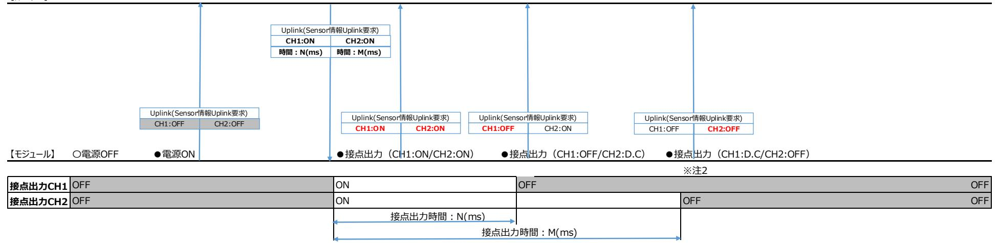

# **BraveJIG 2ch 接点出⼒モジュール**

# **BJ-MD-CO-01**

# **ファームウェア**

# **Rev. 1.0**

DESIGNED BY Braveridge Co., Ltd.

| 内容 |
|----|
|    |

| 1.概要  4                                                                                                         |
|-----------------------------------------------------------------------------------------------------------------|
| 1-1 対象ハードウェア  4                                                                                                 |
| 1-2 機能概要  4                                                                                                     |
| 2.機能説明 6                                                                                                        |
| 2-1 接点出⼒機能 6                                                                                                    |
| 2-2 LED 表⽰機能  6                                                                                                 |
| 2-3 Bluetooth®LE 通信(Uplink/Downlink)  7 2-3-1 Uplink 8 2-3-2 Downlink  8                                  |
| 2-4 NFC ペアリング機能  8 2-4-1 NFC ペアリング操作時の本製品の向きの検知  8                                                           |
| 2-5 バッテリー残量監視 9                                                                                                 |
| 2-6 ペアリング判定機能【電源 ON 時のみ】 9                                                                                      |
| 2-7 パラメータ設定情報の変更/取得機能 9 2-7-1 パラメータ設定情報の変更⽅法について  9 2-7-2 パラメータ設定情報の取得⽅法について  9 2-7-3 変更可能なパラメータについて 9 |
|                                                                                                                 |
| 2-8 DFU 機能  9                                                                                                   |
| 2-9 デバイス再起動(リセット)機能 10                                                                                          |
| 3.パラメータ情報 10                                                                                                    |
| 4.動作フロー  12                                                                                                     |
| 4-1 動作フロー【電源 ON 時】  12                                                                                          |
| 4-2 動作フロー【通常動作中(Bluetooth®LE 通信中)】 13                                                                           |
| 5.Uplink データ仕様  13                                                                                              |
| 5-1 センサー情報 13                                                                                                   |
| 5-2 パラメータ情報  13                                                                                                 |
| 6.Downlink データ仕様  14                                                                                            |
| 6-1 即時 Uplink 要求  14                                                                                            |
| 6-2 パラメータ情報設定要求 14                                                                                              |
| 6-3 接点出⼒要求 14                                                                                                   |
| 6-4 センサーDFU 要求  15                                                                                              |
| 6-5 パラメータ情報取得要求 16                                                                                              |

| 7.電池駆動時(Bluetooth®LE 通信時)の各設定における電池持ち時間 17             |  |
|--------------------------------------------------------|--|
| 8.製品到着から使⽤開始までの流れ 18                                   |  |
| 8-1 BraveJIG 2ch 接点出⼒モジュールと BraveJIG ルーターのペアリング登録  18  |  |
| 8-2 BraveJIG 2ch 接点出⼒モジュールと BraveJIG ルーターの機器接続と利⽤開始 18 |  |
| 9. DFU(デバイス・ファームウェア・アップデート)について 19                     |  |
| 10. Revision 管理  19                                 |  |
| 11. 補⾜資料 1  1                                          |  |

#### **1.概要**

本仕様書は、BraveJIG 2ch 接点出⼒モジュールに使⽤するファームウェア(以降、本製品とする)のソフトウェア仕様を記 したものです。

#### **1-1 対象ハードウェア**

本仕様書の対象とするハードウェアを以下に⽰します。

<BraveJIG 2ch 接点出⼒モジュール>

| 製品名                    | 型番          |
|------------------------|-------------|
| BraveJIG 2ch 接点出⼒モジュール | BJ-MD-CO-01 |

<BraveJIG モジュール⽤ Y 端⼦ハーネス>

| 製品名                           | 型番              |
|-------------------------------|-----------------|
| BraveJIG モジュール⽤ Y 端⼦ハーネス A 1m | BJ-MDS-HNY-S-01 |

#### **1-2 機能概要**

BraveJIG 2 チャネル接点出⼒モジュールは、BraveJIG モジュール⽤ Y 端⼦ハーネスを介して接続された外部機器に 対し、Bluetooth® LE 通信を通じて上位アプリケーションからの ON/OFF 制御を可能にします。

また、本モジュールで 2 チャネルの接点出⼒ポートに対しては以下の制御も可能です。

· 接点出⼒制御:

上位アプリケーションからのコマンドに基づき、2 つの独⽴した接点出⼒チャネルを ON/OFF 制御できます。

· 状態通知:

各接点出⼒チャネルの状態が変更された場合、または死活監視機能による確認後(24 時間ごと)、現在の接点出 ⼒情報をアップリンクデータとして上位アプリケーションに送信します。

なお、モジュール本体への給電⽅式としては、設置場所や利⽤形態に応じてバッテリー給電か外部給電(モジュールケーブ ル接続など)のどちらかを選択して給電することが可能です。

**【Bluetooth®LE 通信(バッテリー給電時)】**

## **【Bluetooth®LE 通信(外部給電時)】**

# **2.機能説明**

## **2-1 接点出⼒機能**

本製品は、2 チャネルの接点出⼒ポート(端⼦)ごとに接点出⼒の ON/OFF を制御をすることができます。

| 項⽬          | 説明                        |
|-------------|---------------------------|
| 接点出⼒情報(CH1) | OFF(0)/ON(1)              |
| 接点出⼒時間      | 出⼒維持(0)/出⼒時間(1ms~65535ms) |
| 接点出⼒情報(CH2) | OFF(0)/ON(1)              |
| 接点出⼒時間      | 出⼒維持(0)/出⼒時間(1ms~65535ms) |

※接点出⼒時間指定時の接点出⼒ ON/OFF 制御の詳細については、別紙【補⾜資料 1.】を参照ください。

# **2-2 LED 表⽰機能**

本製品の動作状態を以下の様に LED 点灯パターンで表⽰します。

#### ■本製品の動作状態と LED 点灯パターン表

| 優先 | 状態                   | LED(発光⾊) |     |      | 備考                 |
|----|----------------------|----------|-----|------|--------------------|
|    |                      | レッド      | ブルー | グリーン |                    |
| ⾼  | LowBattery 状態        | 点滅       | -   | -    | 1 秒点灯、3 秒消灯を繰り返す   |
|    | ペアリング FAULT 状態 ※1 | 点滅       | -   | -    | 0.1 秒点灯、1 秒消灯を繰り返す |
|    | DFU 実⾏中 ※2        | -        | -   | 点滅   | 0.1 秒点灯、1 秒消灯を繰り返す |
|    | PowerON              | -        | 点灯  | -    | 2 秒点灯→消灯           |
| 低  | 上記以外(通常動作中)          | -        | -   | -    | 無灯                 |

※1︓電源 ON 時にペアリング異常を検出時に点灯する(ペアリング無し/不⼀致、NFC メモリ異常など) ※2︓DFU 実⾏中(DFU データ受信開始〜DFU データ FLASH 書き込み中)のみ点滅する

■本製品の動作状態と LED 点灯パターン状態遷移図

# **2-3 Bluetooth®LE 通信(Uplink/Downlink)**

本製品はモジュール本体に接続された接点出⼒端⼦が出⼒している接点出⼒情報を、無線通信(Bluetooth®LE 通信)を介して Uplink データとして BraveJIG ルーターに通知します。 また、逆に BraveJIG ルーター経由で本製品に対してパラメータ設定値の取得/変更や DFU 実⾏などの指⽰を Downlink コマンドにより制御することも可能です。

#### **2-3-1 Uplink**

以下の情報を Uplink することができます。

| Uplink 情報   | Uplink タイミング                       |
|-------------|------------------------------------|
| 接点出⼒状態(CH1) | ①モジュールの電源 ON 直後(必ず初回 Uplink として送信) |
| 接点出⼒状態(CH2) | ②即時 Uplink 要求された場合                 |
|             | ③各チャンネルの接点出⼒が Downlink で変更された場合    |
|             | ④各チャンネルの接点出⼒がタイマで接点出⼒ OFF になった場合   |
|             | ⑤死活監視機能が有効の場合、24 時間経過タイミングごと       |
| パラメータ情報     | Downlink でパラメータ情報取得要求された場合         |

詳細については、「**5.Uplink データ仕様**」を参照。

## **2-3-2 Downlink**

以下の指⽰を Downlink することができます。

| Downlink 情報  | 動作概要                                 |
|--------------|--------------------------------------|
| 即時 Uplink 要求 | 現在の各接点出⼒チャネルの状態を Uplink を要求します。      |
| パラメータ情報設定要求  | 本製品のパラメータ情報を設定します。                   |
| パラメータ情報取得要求  | 本製品のパラメータ情報の Uplink を要求します。          |
| 接点出⼒要求       | 各接点出⼒チャンネルの接点出⼒ ON/OFF を要求します。       |
| センサーDFU 要求   | 本製品の DFU ⽤ファイルで F/W アップデートの実⾏を要求します。 |
| デバイス再起動      | 本製品へ再起動を要求します。                       |

詳細については、「**6.Downlink データ仕様**」を参照。

#### **2-4 NFC ペアリング機能**

本製品は、NFC-Tag チップ「NFC/RFID Dinamic TAG IC(ST25DV04KCS)」と NFC アンテナを内蔵しており、 本製品を BraveJIG ルーターの NFC アンテナの(ホール素⼦ 1,2)へかざすことで、BraveJIG ルーターと本製品の ペアリング登録/解除が簡単に⾏えます。

なお、本製品と BraveJIG ルーターとの間でのペアリング登録操作時には、前述の NFC-Tag チップ内の不揮発メモリに ペアリング情報の書き込みが⾏われ、逆にペアリング解除操作時にはペアリング登録の際に書込まれた NFC-Tag チップ内 の不揮発メモリ内のペアリング情報の消去を⾏います。

#### **2-4-1 NFC ペアリング操作時の本製品の向きの検知**

本製品は、上⾯ケースには NFC アンテナに加えてペアリング操作時の⽅向(正⽅向/逆⽅向)を BraveJIG ルーターが 検知するための磁⽯を内蔵しています。

また、これに対して BraveJIG ルーターには、この磁⽯を検知してペアリング操作時の本製品の向きを判別するためのホール 素⼦をケース上⾯の NFC アンテナ部分に内蔵しています。

BraveJIG ルーターは以下で⽰す様に前述のホール素⼦で検知した本製品の向きによってペアリング登録/ペアリング解除 を判断してペアリング情報の書き込み/消去を⾏います。

| 操作      | ホール素⼦ ※       | 備考              |
|---------|---------------|-----------------|
| ペアリング登録 | ホール素⼦ 1 ※1 | ペアリング情報を書き込みます。 |
| ペアリング解除 | ホール素⼦ 2 ※1 | ペアリング情報を消去します。  |

※1 ホール素⼦ 1︓ルーター天⾯上⽅(正⽅向)、ホール素⼦ 2︓ルーター天⾯下⽅(逆⽅法) 詳細は、「8.製品到着から使⽤開始までの流れ」を参照お願いします。

#### **2-5 バッテリー残量監視**

本製品では、バッテリー電圧を1分周期で監視してバッテリー残量(%)の算出を⾏います。このため、本製品のバッテリー 残量(%)の更新周期は上記の監視周期(1 分)となります。

なお、バッテリー残量(%)は Uplink データ(センサー情報)により上位アプリケーションなどで確認することが可能であり、 本製品の LED 表⽰でも LowBattery 状態(レッド⾊の LED が点滅する)か否を⽬視確認することも可能です。

#### **2-6 ペアリング判定機能【電源 ON 時のみ】**

本製品では、モジュール本体の電源 ON シーケンスにおいて NFCTag チップ内のペアリング情報の読み出しを⾏って Bluetooth®LE 通信モードによる動作を開始するか、或いは FAULT 状態(ペアリング無し時や NFCTag チップ故障 などにより動作ができない状態)に遷移するかを判定します。

#### **■ペアリング判定結果によるモジュール動作**

| 通信モード判定結果      | 動作モード(次動作)         | 備考                          |
|----------------|--------------------|-----------------------------|
| ①ペアリング情報無し     | FAULT 状態(ペアリング異常)  | NFCTag チップ内のペアリング情報(ルーター情報) |
|                |                    | が無い場合                       |
| ②ペアリング情報有り     | Bluetooth®LE 通信モード | ただし、ペアリング先のルーターが通信圏外の場合は    |
|                |                    | 通信不可となる                     |
| ③NFC-Tag チップ異常 | FAULT 状態(故障)       | NFCTag チップ内のペアリング情報が読み出せない  |
|                |                    | 場合(チップ故障など)                 |

#### **2-7 パラメータ設定情報の変更/取得機能**

本製品のパラメータ情報の変更/取得することができます。

#### **2-7-1 パラメータ設定情報の変更⽅法について**

本製品のパラメータ設定情報の変更は以下の⽅法で⾏います。

上位アプリケーションなどから BraveJIG ルーターを介して Downlink コマンド(パラメータ情報設定要求)を送信すること でパラメータ情報を変更することができます。

#### **2-7-2 パラメータ設定情報の取得⽅法について**

本製品のパラメータ情報の設定は以下の⽅法で⾏います。

上位アプリケーションなどから BraveJIG ルーターを介して Downlink コマンド(パラメータ情報取得要求)をすることによ り、UpLink データ(パラメータ情報)でパラメータ情報を取得することができます。

#### **2-7-3 変更可能なパラメータについて**

本製品の変更/取得可能なパラメータに関しては「**3.パラメータ情報**」を参照下さい。

#### **2-8 DFU 機能**

本製品の DFU(ダウンロードファームウェアアップデート)は以下の⽅法で⾏えます。

上位アプリケーションなどから BraveJIG ルーターを介して Downlink コマンド(センサーDFU)を送信することでファーム ウェアアップデートを実⾏することができます。

なお、DFU を実⾏する際において、本製品のバッテリー残量が既に Low Battery 状態である場合は、DFU の実⾏は 拒否(センサーDFU コマンドの送信に対してエラー応答)されます。

また、本製品に対する DFU の実⾏中(DFU データのダウンロード中)に Low Battery 状態が検出された場合も同様に DFU データのダウンロードを中⽌して DFU を強制終了します。

## **2-9 デバイス再起動(リセット)機能**

本製品のデバイス再起動は以下の⽅法で⾏えます。上位アプリケーションなどから BraveJIG ルーターを介して Downlink コマンド(デバイス再起動要求)を本製品に送信することで本製品のデバイス再起動が⾏えます。

# **3.パラメータ情報**

本製品のパラメータを以下に⽰します。

| カテゴリ      | 項⽬                 | サイズ   | 設定情報                                |  |  |  |
|-----------|--------------------|-------|-------------------------------------|--|--|--|
| BraveGATE | BraveGATE DeviceID | 8byte | BraveJIG ルーターと通信する為に必要な DeviceID    |  |  |  |
|           | BraveGATE SensorID | 2byte | BraveJIG ルーターと通信する為に必要な SensorID    |  |  |  |
|           |                    |       | 本製品の SensorID は【0x128】固定とする         |  |  |  |
| デバイス設定    | タイムゾーン設定           | 1byte | タイムゾーン設定に関する設定情報を以下に⽰します            |  |  |  |
|           |                    |       | 設定値 説明                           |  |  |  |
|           |                    |       | 0x00 ⽇本時間                        |  |  |  |
|           |                    |       | 0x01 UTC                         |  |  |  |
|           |                    |       | 上記以外 ⽇本時間                        |  |  |  |
|           |                    |       | 【初期値︓0x01(UTC)】                     |  |  |  |
|           | BLE Mode           | 1byte | Bluetooth® LE 通信モードの設定情報を以下に⽰し      |  |  |  |
|           |                    |       | ます                                  |  |  |  |
|           |                    |       | 設定値 説明                           |  |  |  |
|           |                    |       | 0x00 LongRange                   |  |  |  |
|           |                    |       | 0x01 Legacy                      |  |  |  |
|           |                    |       | 上記以外 LongRange                   |  |  |  |
|           |                    |       | 【初期値︓0x00(LongRange)】               |  |  |  |
|           |                    |       | ※Bluetooth® LE 通信モードは、BraveJIG ルーター |  |  |  |
|           |                    |       | と同じ通信モードに設定すること                     |  |  |  |
|           |                    |       | ※Bluetooth® LE 通信モードを変更する際は、最初に     |  |  |  |
|           |                    |       | 本製品の設定値を変更し、その後 BraveJIG ルーター       |  |  |  |
|           |                    |       | の設定を同じ通信モードの設定値に変更すること              |  |  |  |

| Tx Power | 1byte |                   | Bluetooth® LE 通信の送信電波出⼒の設定情報を |  |
|----------|-------|-------------------|-------------------------------|--|
|          |       | 以下に⽰します           |                               |  |
|          |       | 設定値               | 説明                            |  |
|          |       | 0x00              | ±0dBm                         |  |
|          |       | 0x01              | +4dBm                         |  |
|          |       | 0x02              | -4dBm                         |  |
|          |       | 0x03              | -8dBm                         |  |
|          |       | 0x04              | -12dBm                        |  |
|          |       | 0x05              | -16dBm                        |  |
|          |       | 0x06              | -20dBm                        |  |
|          |       | 0x07              | -40dBm                        |  |
|          |       | 0x08              | +8dBm                         |  |
|          |       | 上記以外              | ±0dBm                         |  |
|          |       | 【初期値︓0x00(±0dBm)】 |                               |  |

| カテゴリ   | 項⽬                 | サイズ   | 設定情報                        |                             |                             |    |  |  |  |  |  |        |  |                              |  |
|--------|--------------------|-------|-----------------------------|-----------------------------|-----------------------------|----|--|--|--|--|--|--------|--|------------------------------|--|
| デバイス設定 | Advertise Interval | 2byte | Advertise を発信する間隔を設定する      |                             |                             |    |  |  |  |  |  |        |  |                              |  |
|        |                    |       | 設定値                         |                             | 説明                          |    |  |  |  |  |  |        |  |                              |  |
|        |                    |       | 0x0064                      |                             | 100ms 周期に Advertise を発信する   |    |  |  |  |  |  |        |  |                              |  |
|        |                    |       | :                           |                             | :                           |    |  |  |  |  |  |        |  |                              |  |
|        |                    |       | 0x03E8                      | 1,000ms 周期に Advertise を発信する |                             |    |  |  |  |  |  |        |  |                              |  |
|        |                    |       | :                           |                             | :                           |    |  |  |  |  |  |        |  |                              |  |
|        |                    |       |                             |                             |                             |    |  |  |  |  |  | 0x2710 |  | 10,000ms 周期に Advertise を発信する |  |
|        |                    |       | 上記以外                        |                             | 1,000ms 周期に Advertise を発信する |    |  |  |  |  |  |        |  |                              |  |
|        |                    |       | 【初期値︓0x0064(100ms)】         |                             |                             |    |  |  |  |  |  |        |  |                              |  |
|        | Alive Monitoring   | 1byte | 死活監視動作による故障検知の ON/OFF 設定をする |                             |                             |    |  |  |  |  |  |        |  |                              |  |
|        |                    |       |                             | 設定値                         |                             | 説明 |  |  |  |  |  |        |  |                              |  |
|        |                    | 0x00  |                             | OFF                         |                             |    |  |  |  |  |  |        |  |                              |  |
|        |                    |       | 0x01                        |                             | ON                          |    |  |  |  |  |  |        |  |                              |  |
|        |                    |       | 【初期値︓0x01 (ON)】             |                             |                             |    |  |  |  |  |  |        |  |                              |  |

**4.動作フロー**

**4-1 動作フロー【電源 ON 時】**

# **4-2 動作フロー【通常動作中(Bluetooth®LE 通信中)】**

# **5.Uplink データ仕様**

BraveJIG 2ch 接点出⼒モジュールから通知される情報ついて以下に⽰します。

# **5-1 センサー情報**

| 項⽬          | サイズ(byte) | Data          | 説明                     | 備考                  |
|-------------|-----------|---------------|------------------------|---------------------|
| SensorID    | 2         | 0x0128        | 2ch 接点出⼒モジュール          | 製品の Sensor ID を設定する |
| Sequence No | 2         | 0x0000~0xFFFF |                        |                     |
| Sensor Data | 1         | BatteryLevel  | バッテリーレベル(%)            |                     |
|             | 1         | Reserve       | ※予約                    | 必ず 0x00 が設定される      |
|             | 4         | Time          | センサーリード時刻※unsigned int | [デバイス設定情]TimeZone の |
|             |           |               | 型(タイムゾーン時刻)            | 時刻                  |
|             | 2         | sampleNum     | サンプル数 n=0x0001 固定      | リトルエンディアン           |
|             | 1         | Signal        | 接点出⼒状態(CH1)            | 設定出⼒ OFF:0x00       |
|             |           | Status(CH1)   |                        | 設定出⼒ ON :0x01       |
|             | 1         | Signal        | 接点出⼒状態(CH2)            | 設定出⼒ OFF:0x00       |
|             |           | Status(CH2)   |                        | 設定出⼒ ON :0x01       |

# **5-2 パラメータ情報**

| 項⽬          | サイズ(byte) | Data    | 説明        | 備考 |
|-------------|-----------|---------|-----------|----|
| SensorID    | 2         | 0x0000  | エンドデバイス本体 |    |
| Sequence No | 2         | 0xFFFFF |           |    |

| Sensor Data | 2 | SensorID           | 0x0128 固定                | 本製品に接続されている       |
|-------------|---|--------------------|--------------------------|-------------------|
|             |   |                    |                          | Sensor の SensorID |
|             | 3 | FW Version         | 本製品の FW バージョン            |                   |
|             | 1 | TimeZone           | タイムゾーン設定                 |                   |
|             | 1 | BLE Mode           | Bluetooth® LE 通信モードの設定情報 |                   |
|             | 1 | Tx Power           | Bluetooth® LE 通信の送信電波出⼒  |                   |
|             | 2 | Advertise Interval | Advertise を発信する間隔        | リトルエンディアン         |
|             | 1 | Alive Monitoring   | 死活監視動作の ON/OFF 設定        | OFF(0)/ON(1)      |

# **6.Downlink データ仕様**

BraveJIG 2ch 接点出⼒モジュールから送信する情報ついて以下に⽰します。

## **6-1 即時 Uplink 要求**

| 項⽬          | サイズ(byte) | Data   | 説明            | 備考                |
|-------------|-----------|--------|---------------|-------------------|
| SensorID    | 2         | 0x0128 | 2ch 接点出⼒モジュール |                   |
| CMD         | 1         | 0x00   | 即時 Uplink 要求  | SEND_DATA_AT_ONCE |
| Sequence No | 2         | 0xFFFF | 固定            |                   |
| DATA        | ―         | ―      | なし            |                   |

#### **6-2 パラメータ情報設定要求**

| 項⽬          | サイズ(byte) | Data               | 説明                       | 備考                |
|-------------|-----------|--------------------|--------------------------|-------------------|
| SensorID    | 2         | 0x0000             | エンドデバイス本体                |                   |
| CMD         | 1         | 0x05               | Reg 設定                   | SET_REGISTER      |
| Sequence No | 2         | 0xFFFF             | 固定                       |                   |
| DATA        | 2         | SensorID           | 0x0128 固定                | 本製品に接続されている       |
|             |           |                    |                          | Sensor の SensorID |
|             | 1         | TimeZone           | タイムゾーン設定                 |                   |
|             | 1         | BLE Mode           | Bluetooth® LE 通信モードの設定情報 |                   |
|             | 1         | Tx Power           | Bluetooth® LE 通信の送信出⼒    |                   |
|             | 2         | Advertise Interval | Advertise を発信する間隔        | リトルエンディアン         |
|             | 1         | Alive Monitoring   | 死活監視動作の ON/OFF 設定        | OFF(0)/ON(1)      |

#### **6-3 接点出⼒要求**

| 項⽬          | サイズ(byte) | Data             | 説明               | 備考                      |
|-------------|-----------|------------------|------------------|-------------------------|
| SensorID    | 2         | 0x0128           | 2ch 接点出⼒モジュール    |                         |
| CMD         | 1         | 0x11             | 接点出⼒要求           | SET_SENSOR_OUTPUT       |
| Sequence No | 2         | 0xFFFF           | 固定               | リトルエンディアン               |
| DATA※       | 1         | Signal Mode(CH1) | 接点出⼒情報(CH1)      | 設定出⼒ OFF:0x00           |
|             |           |                  |                  | 設定出⼒ ON :0x01           |
|             |           |                  |                  | 設定出⼒なし(don't care)︓0xFF |
|             |           |                  |                  | 上記以外︓Error Result 返却    |
|             | 2         | Signal Out Time  | 接点出⼒時間(CH1) (ms) | 出⼒維持(0)/出⼒時間            |
|             |           | (CH1)            | ※1               | (1ms~65535ms)           |
|             |           |                  |                  | リトルエンディアン               |
|             | 1         | Signal Mode(CH2) | 接点出⼒情報(CH2)      | 設定出⼒ OFF:0x00           |
|             |           |                  |                  | 設定出⼒ ON :0x01           |
|             |           |                  |                  | 設定出⼒なし(don't care)︓0xFF |
|             |           |                  |                  | 上記以外︓Error Result 返却    |

| 2 | Signal Out Time | 接点出⼒時間(CH2) (ms) | 出⼒維持(0)/出⼒時間  |
|---|-----------------|------------------|---------------|
|   | (CH2)           | ※1               | (1ms~65535ms) |
|   |                 |                  | リトルエンディアン     |

※1︓接点出⼒時間は接点出⼒指定が ON 指⽰の場合のみ有効です。(接点状態が OFF 指⽰または設定出⼒なしの場合は無視されます)

# **6-4 センサーDFU 要求**

【基本フォーマット(Sequence No = 0x0000〜xFFFF)】

| 項⽬          | サイズ(byte) | Data            | 説明                 | 備考                   |
|-------------|-----------|-----------------|--------------------|----------------------|
| SensorID    | 2         | 0x0128          | 2ch 接点出⼒モジュール      |                      |
| CMD         | 1         | 0x12            | センサーDFU            | UPDATE_SENSOR_FIRMWA |
|             |           |                 |                    | RE                   |
| Sequence No | 2         | 0x0000〜0xFFFF   | 固定                 | リトルエンディアン            |
| DATA※       | 1~238     | 各転送ブロック         | DFU データ(分割バイナリデータ) | ・DFU データ転送ブロックサイズ    |
|             |           | (Sequence No 毎) |                    | (Max)=Max238byte     |
|             |           | にデータの設定フォーマット   |                    | ・DFU データは転送ブロック(先頭   |
|             |           | が異なる            |                    | /継続/最終)毎に下記⽰すフ       |
|             |           | ※詳細は後述を参照       |                    | ォーマットでデータを設定する       |

計 6〜243(Max)byte

#### 【先頭ブロック(Sequence No = 0x0000)】

| 項⽬          | サイズ(byte) | Data              | 説明             | 備考                     |
|-------------|-----------|-------------------|----------------|------------------------|
| SensorID    | 2         | 0x0128            | 2ch 接点出⼒モジュール  |                        |
| CMD         | 1         | 0x12              | センサーDFU        | UPDATE_SENSOR_FIRMWARE |
| Sequence No | 2         | 0x0000            | 先頭ブロック(DFU 開始) | リトルエンディアン              |
| DATA        | 2         | hardwareID[2byte] | 0x0000︓固定      | リトルエンディアン              |
|             | 236       | Reserve           | 0xFF 埋め        |                        |

計 243byte

#### 【第 2 ブロック(Sequence No = 0x0001)】

| 項⽬          | サイズ(byte) | Data          | 説明                   | 備考                     |
|-------------|-----------|---------------|----------------------|------------------------|
| SensorID    | 2         | 0x0128        | 2ch 接点出⼒モジュール        |                        |
| CMD         | 1         | 0x12          | センサーDFU              | UPDATE_SENSOR_FIRMWARE |
| Sequence No | 2         | 0x0001        | 第 2 ブロック(DFU データ⻑+先頭 | リトルエンディアン              |
|             |           |               | DFU データ)             |                        |
| DATA        | 4         | dfuDataLength | DFU データ⻑(CRC データ含む)  | リトルエンディアン              |
|             | 234       | dfuDataBody   | DFU データ(バイナリ Body)   |                        |

計 243byte

#### 【第 3 ブロック以降〜最終ブロック直前まで(Sequence No = 0x0002〜0xXXX)】

| 項⽬          | サイズ(byte)          | Data          | 説明                 | 備考                     |
|-------------|--------------------|---------------|--------------------|------------------------|
| SensorID    | 2                  | 0x0128        | 2ch 接点出⼒モジュール      |                        |
| CMD         | 1                  | 0x12          | センサーDFU            | UPDATE_SENSOR_FIRMWARE |
| Sequence No | 2                  | 0x0002〜0xXXXX | 第 3 ブロック以降︓継続データ   | リトルエンディアン              |
|             |                    |               | (DFU データのみ)        |                        |
| DATA        | 238 dfuDataBody |               | DFU データ(バイナリ Body) |                        |
|             |                    | [240byte]     |                    |                        |

計 243byte

#### 【最終ブロック(Sequence No = 0xFFFF)】

| 項⽬       | サイズ(byte) Data |        | 説明            | 備考 |
|----------|-------------------|--------|---------------|----|
| SensorID | 2                 | 0x0128 | 2ch 接点出⼒モジュール |    |

| CMD           | 1 | 0x12          | センサーDFU                | UPDATE_SENSOR_FIRMWARE |
|---------------|---|---------------|------------------------|------------------------|
| Sequence No   | 2 | 0xFFFF        | 最終ブロック︓継続データ(DFU デー    | リトルエンディアン              |
|               |   |               | タ)                     |                        |
| DATA 0〜234 |   | dfuDataBody   | DFU データ(バイナリ Body)     |                        |
|               |   | [n byte]      |                        |                        |
|               | 4 | dfuCrc[4byte] | DFU データ(DFU バイナリ Body) | リトルエンディアン              |

計 6〜243(Max)byte

#### **6-5 パラメータ情報取得要求**

| 項⽬          | サイズ(byte) | Data   | 説明          | 備考                 |
|-------------|-----------|--------|-------------|--------------------|
| SensorID    | 2         | 0x0000 | エンドデバイス本体   |                    |
| CMD         | 1         | 0x0D   | デバイス情報取得要求  | GET_DEVICE_SETTING |
| Sequence No | 2         | 0xFFFF | 固定          |                    |
| DATA        | 1         | 0x00   | パラメータ情報取得要求 |                    |

#### **6-6 デバイス再起動要求**

| 項⽬          | サイズ(byte) | Data   | 説明        | 備考      |
|-------------|-----------|--------|-----------|---------|
| SensorID    | 2         | 0x0000 | エンドデバイス本体 |         |
| CMD         | 1         | 0xFD   | デバイス再起動   | RESTART |
| Sequence No | 2         | 0xFFFF | 固定        |         |
| DATA        | ―         | ―      | なし        |         |

# **7.電池駆動時(Bluetooth®LE 通信時)の各設定における電池持ち時間**

 BraveJIG 2ch 接点出⼒モジュールの電池駆動時における代表的な設定値に対するおおよその電池持ち時間を以下に ⽰します。

## **<Bluetooth®LE 通信モード︓Legacy の場合>**

| パラメータ設定情報 |         |                    |                | 電池持ち(⽇) |
|-----------|---------|--------------------|----------------|---------|
| 計測モード     | TxPower | Advertise Interval | 接点状態           | ※参考値    |
| -         | 0dBm    | 100ms              | OFF 出⼒         | 856.2   |
|           |         |                    | CH1 のみ ON 出⼒   | 18.0    |
|           |         |                    | CH2 共に ON 出⼒   | 8.8     |
|           |         | 1,000ms            | OFF 出⼒         | 5688.3  |
|           |         |                    | CH1 のみ ON 出⼒   | 18.3    |
|           |         |                    | CH2 共に ON 出⼒   | 8.9     |
|           |         |                    | 1CH のみ ON 出⼒   |         |
|           |         |                    | (1 時間に 1 分間)   | 925.9   |
|           |         |                    | 1CH のみ ON 出⼒   |         |
|           |         |                    | (1分間に 1 秒間 ON) | 799.7   |

※参考値︓BraveJIG モジュールバッテリー2×2 使⽤時

#### **<Bluetooth®LE 通信モード︓LongRange の場合>**

| パラメータ設定情報 |         |                    | 電池持ち(⽇)         |        |
|-----------|---------|--------------------|-----------------|--------|
| 計測モード     | TxPower | Advertise Interval | 接点状態            | ※参考値   |
| - 0dBm |         | 100ms              | OFF 出⼒          | 231.9  |
|           |         |                    | CH1 のみ ON 出⼒    | 17.0   |
|           |         |                    | CH2 共に ON 出⼒    | 8.8    |
|           |         | 1,000ms            | OFF 出⼒          | 1967.7 |
|           |         |                    | CH1 のみ ON 出⼒    | 18.2   |
|           |         |                    | CH2 共に ON 出⼒    | 8.9    |
|           |         |                    | 1CH のみ ON 出⼒    |        |
|           |         |                    | (1 時間に 1 分間 ON) | 705.9  |
|           |         |                    | 1CH のみ ON 出⼒    |        |
|           |         |                    | (1分間に 1 秒間 ON)  | 512.6  |

※参考値︓BraveJIG モジュールバッテリー2×2 使⽤時

## **8.製品到着から使⽤開始までの流れ**

## **8-1 BraveJIG 2ch 接点出⼒モジュールと BraveJIG ルーターのペアリング登録**

BraveJIG 2ch 接点出⼒モジュールと BraveJIG ルーターのペアリング登録⼿順について以下に⽰します。

- 1. BraveJIG ルーターを電源 ON の状態にしておく。
- 2. BraveJIG 2ch 接点出⼒モジュールを電源 OFF 状態(モジュール⽤バッテリーやモジュールケーブルで給電しない)に する。
- 3. BraveJIG 2ch 接点出⼒モジュールの天⾯(NFC アンテナ)の「Pairing」の印刷が、BraveJIG ルーター天⾯(同じく NFC アンテナ)の「Pairing/Reset」の印刷と同じ⽅向に向けた状態で BraveJIG 2ch 接点出⼒モジュールを裏返して、 両製品の天⾯同⼠が重なるようにしてペアリング登録を⾏う。

モジュールは、必ず取付ベース等から外し、単体かつ電源 OFF の状態で操作して下さい。 複数のモジュールを横に並べた状態でペアリング操作を⾏うと、⼀部のモジュールが正常にペアリング登録されず、 ルーターとの通信ができなくなる恐れがあります。

4. BraveJIG ルーターからの⾳声ガイダンス「ペアリングが完了しました」により、ペアリングが正常に⾏われた事を確認する。 以上でペアリング登録の作業は終了です。

#### **8-2 BraveJIG 2ch 接点出⼒モジュールと BraveJIG ルーターの機器接続と利⽤開始**

BraveJIG 2ch 接点出⼒モジュール BraveJIG ルーターの接続⼿順について以下に⽰します。

- 1. BraveJIG 2ch 接点出⼒モジュールに Y 端⼦ハーネスを接続する(事前に BraveJIG モジュール⽤ Y 端⼦ハーネスが 接続されていない場合のみ)。
- 2. BraveJIG 2ch 接点出⼒モジュールを電源 ON 状態(モジュール⽤バッテリーやモジュールケーブルに接続する)にする。
- 3. BraveJIG 2ch 接点出⼒モジュール ON 起動時の LED 表⽰(ブルー︓2 秒 ON→消灯)から LED が全消灯となり 通常動作状態となる事を確認する。

以上で機器接続の作業は終了です(機器の利⽤開始状態になります)。

# **9. DFU(デバイス・ファームウェア・アップデート)について**

お客さまに、より安全で快適に BraveJIG 製品をご利⽤いただくため、機能や操作性向上を⽬的に発売後に機種毎に機能の アップデートを⾏っています。必ず最新ソフトウェアへのアップデートをお願いいたします。

【ファイルの⼊⼿先】

本製品の DFU ファイルは、BraveJIG サイト[サポート]ー[DFU の⽅法]から⼊⼿が可能です。 BraveJIG DFU の⽅法ページ https://jig.braveridge.com/support/software/dfu

# **10. Revision 管理**

| Rev | Date      | Firmware | 変更内容 |
|-----|-----------|----------|------|
| 1.0 | 2025/5/19 | Ver1.0.0 | 初版   |

※上記、製品仕様や機能、デザインは変更となる可能性がございます。あらかじめご了承ください。

株式会社 Braveridge に関する詳しい情報は、弊社 Web サイトからご確認ください。

https://www.braveridge.com/

本製品の詳しい使い⽅のご確認、故障や破損についてのお問合せは、下記の QR コード、もしくは URL から製品ページにアクセス しお問合せください。

https://jig.braveridge.com/

株式会社 Braveridge 本社 〒819-0373 福岡県福岡市⻄区周船寺 3-27-2 Tel: 092-834-5789

株式会社 Braveridge ⽷島⼯場 〒819-1122 福岡県⽷島市東 1999-19

# **11. 補⾜資料 1**

■接点出⼒操作のによる接点出⼒(CH1,CH2)状態の変化と Uplink データの送信シーケンス

#### **!"#\$8C8'(F\*9:;-./-00NO**

!"#\$#%

| 3456!7% ,-- | ,/ | ,-- | ,-- |
|-------------|----|-----|-----|
| 3456!78 ,-- | ,/ | ,-- | ,-- |

#### **!"#\$%C'(F\*H,-./0N/OO345678H9:;**

!"#\$#%

| <=>?!@A 34  | 3SS | 34  | 34  |
|-------------|-----|-----|-----|
| <=>?!@' 3SS | 34  | 3SS | 3SS |

#### **!"#\$BCA(F\*HCa<=>?-E6FGeI9JKL/0N/OO:;**

#### **!"#\$%C'(F\*H,-./MNO-3456789:;<=>?@AB@CCaE**

?7UMNO3e,LIJKiMMNO3@A4L;ekJlmnopTKrsWXYZ[#\$\]^TMN\_`eab\_`4McdMNO3@Aefg\,--\_`;hijn\$klmno]^lmpq

?:U5S7\MNO3@A4L;h5S:\MNO3@ACGF\@ArestiuopKvuT5S7\MNO3,--@\rsWXYZ[#\$ewxyMz{|\cc}~lmup\_`o5S:\MNO3,--hijnopT7Ä\rsWXYZ[#\$]^hipq