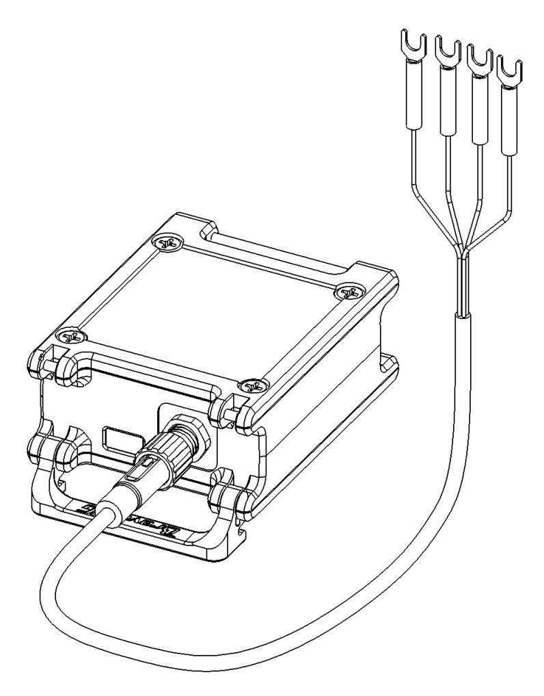
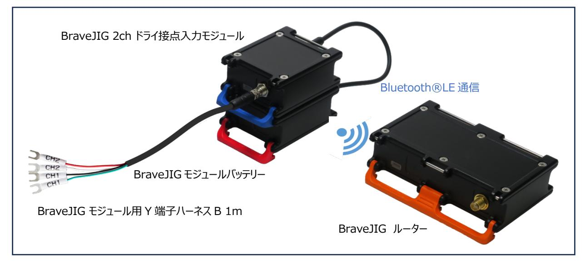
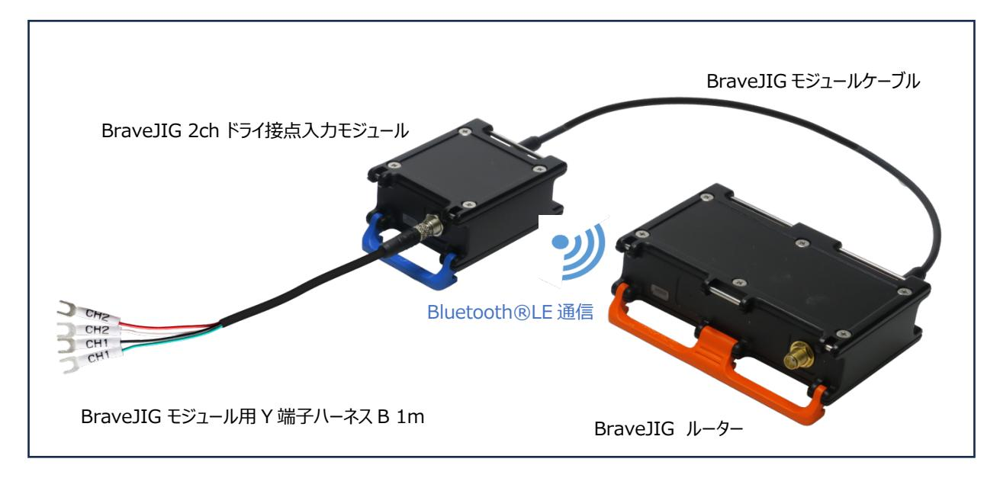
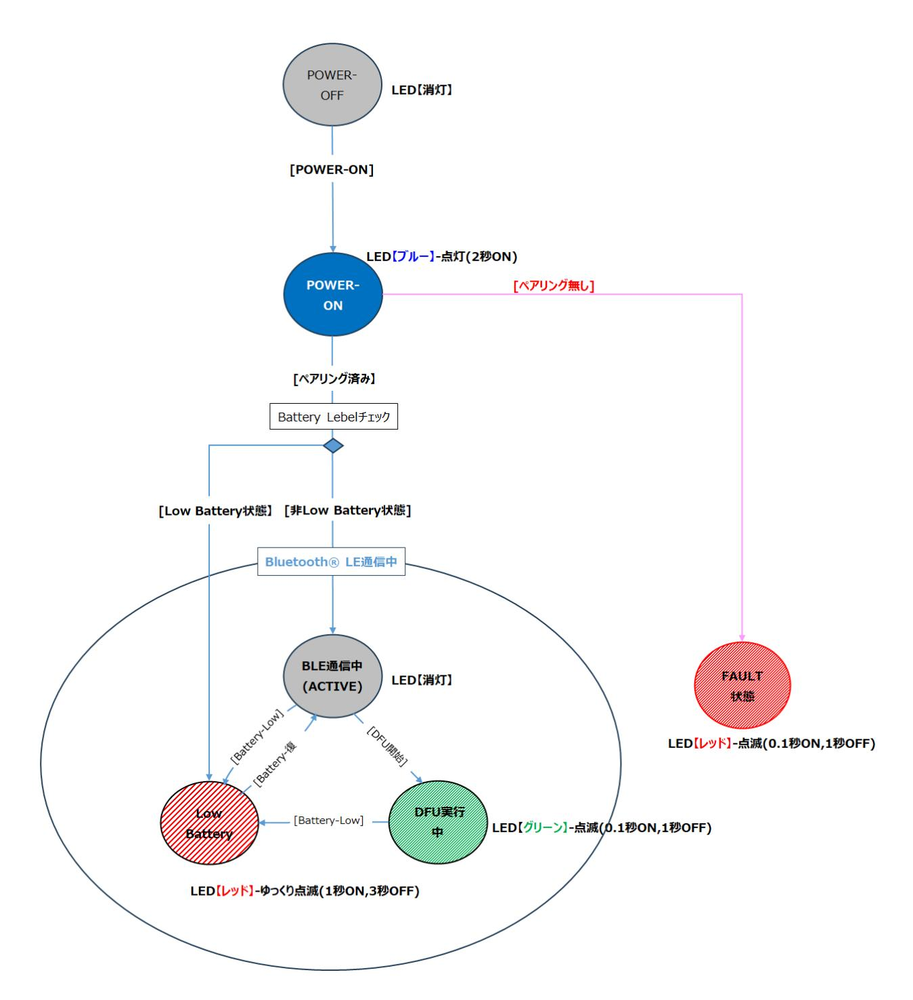
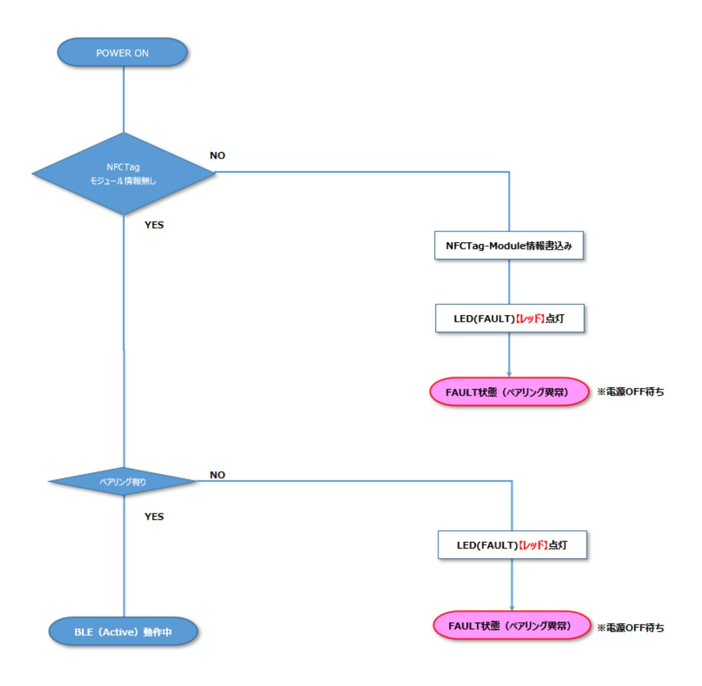
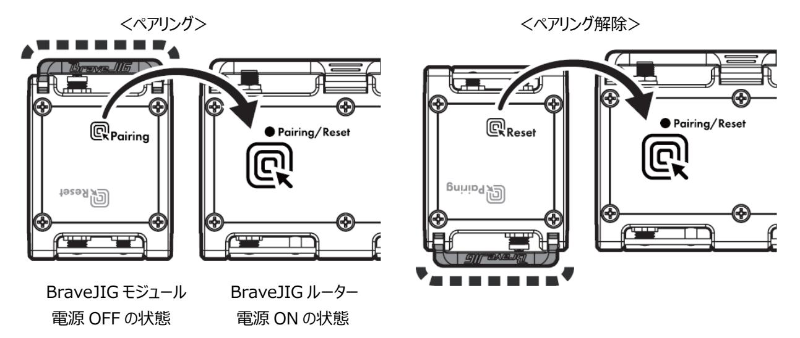
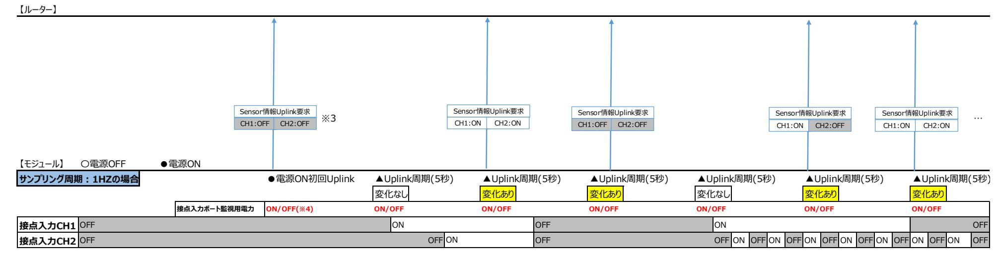

**BraveJIG 2ch ドライ接点⼊⼒モジュール**

# **ファームウェア**

# **BJ-MD-CID-01**

# **Rev. 1.0**

DESIGNED BY Braveridge Co., Ltd.

| 1.概要4                                  |  |
|----------------------------------------|--|
| 1-1 対象ハードウェア4                          |  |
| 1-2 機能概要4                              |  |
| 2.機能説明 6                               |  |
| 2-1 接点⼊⼒機能 6                           |  |
| 2-1-1 接点⼊⼒ポート6                         |  |
| 2-1-2 接点⼊⼒ポート(CH1,CH2)の監視状態とポート状態 6    |  |
| 2-1-3 計測モード6                           |  |
| 2-1-4 チャタリング除去時間指定7                    |  |
| 2-2 LED 表⽰機能8                          |  |
| 2-3 Bluetooth®LE 通信(Uplink/Downlink)10 |  |
| 2-3-1 Uplink 10                        |  |
| 2-3-2 Downlink 10                      |  |
| 2-4 NFC ペアリング機能10                      |  |
| 2-4-1 NFC ペアリング操作時の本製品の向きの検知10         |  |
| 2-5 バッテリー残量監視11                        |  |
| 2-6 ペアリング判定機能【電源 ON 時のみ】 11            |  |
| 2-7 パラメータ設定情報の変更/取得機能 11               |  |
| 2-7-1 パラメータ設定情報の変更⽅法について11             |  |
| 2-7-2 パラメータ設定情報の取得⽅法について11             |  |
| 2-7-3 変更可能なパラメータについて 11                |  |
| 2-8 DFU 機能12                           |  |
| 2-9 デバイス再起動(リセット)機能 12                 |  |
| 2-10 死活監視機能 12                         |  |
| 3.パラメータ情報 13                           |  |
| 4.動作フロー16                              |  |
| 4-1 動作フロー【電源 ON 時】 16                  |  |
| 4-2 動作フロー【通常動作中(Bluetooth®LE 通信中)】 17  |  |
| 5.Uplink データ仕様18                       |  |
| 5-1 センサー情報 18                          |  |
| 5-2 パラメータ情報19                          |  |
| 6.Downlink データ仕様19                     |  |
| 6-1 即時 Uplink 要求19                     |  |
| 6-2 パラメータ情報設定要求 20                     |  |

| 6-3 センサーデータ削除要求(カウントクリア) 20                               |
|-----------------------------------------------------------|
| 6-4 センサーDFU 要求20                                          |
| 6-5 パラメータ情報取得要求 22                                        |
| 6-6 デバイス再起動要求22                                           |
| 7.電池駆動時(Bluetooth®LE 通信時)の各設定における電池持ち時間 23                |
| 8.製品到着から使⽤開始までの流れ 25                                      |
| 8-1 BraveJIG 2ch ドライ接点⼊⼒モジュールと BraveJIG ルーターのペアリング登録25    |
| 8-2 BraveJIG 2ch ドライ接点⼊⼒モジュールと BraveJIG ルーターの機器接続と利⽤開始 25 |
| 9. DFU(デバイス・ファームウェア・アップデート)について 26                        |
| 10. Revision 管理 26                                     |
| Appendix-Ⅰ(計測モード) 1                                       |
| Appendix-Ⅱ(チャタリング除去時間) 4                                  |

#### **1.概要**

本仕様書は、2ch ドライ接点⼊⼒モジュールに使⽤するファームウェア(以降、本製品とする)のソフトウェア仕様を記したもの です。

#### **1-1 対象ハードウェア**

本仕様書の対象とするハードウェアを以下に⽰します。

<2ch ドライ接点⼊⼒モジュール>

| 製品名              | 型番           |
|------------------|--------------|
| 2ch ドライ接点⼊⼒モジュール | BJ-MD-CID-01 |

<BraveJIG モジュール⽤ Y 端⼦ハーネス>

| 製品名                  | 型番            |  |
|----------------------|---------------|--|
| モジュール⽤ Y 端⼦ハーネス B 1m | BJ-MDS-HNY-02 |  |

#### **1-2 機能概要**

本製品は、2 チャネルのドライ接点(無電圧接点)⼊⼒ポートを搭載したセンサーモジュールです。それぞれの⼊⼒ポートに は、⽤途に応じて様々なドライ接点(スイッチ、光電センサーなど)の⼊⼒監視が可能です。

本モジュールを BraveJIG ルーターに接続することで、2 チャネルのドライ接点⼊⼒ポートの状態(ON/OFF)を検知できる ため、以下のような多様な監視・制御が可能な IoT デバイスとしてご利⽤いただけます。

① スイッチの ON/OFF 検知

② 外部機器(光電センサーなど)を利⽤した⽣産数カウント

なお、モジュール本体への給電⽅式としては、設置場所や利⽤形態に応じてバッテリー給電か外部給電(モジュールケーブル 接続など)のどちらかを選択して給電することが可能です。

# **【Bluetooth®LE 通信(バッテリー給電時)】**

# **【Bluetooth®LE 通信(外部給電時)】**

# **2.機能説明**

#### **2-1 接点⼊⼒機能**

本製品は、2 チャネル(CH1,CH2)のドライ接点⼊⼒ポートの監視が可能であり、各ドライ接点⼊⼒ポートの状態を監視 して計測モードに応じたセンサーデータを Uplink データとして送信します。

また、それ以外に上位アプリケーションから BraveJIG ルーター経由で本製品に対してのパラメータ設定や接点⼊⼒ポートの 状態取得(即時 Uplink 要求)などの各種指⽰を Downlink コマンドにより制御することも可能です。

なお、以降の本書記載では「ドライ接点⼊⼒」を「接点⼊⼒」と略して表記します。

# **2-1-1 接点⼊⼒ポート**

本製品は、モジュール⽤ Y 端⼦ハーネスを介して2チャンネルの接点⼊⼒ポートの接続されたリレースイッチなどの機器 の監視を⾏うことが可能です。

また、接点⼊⼒ポートへ接続する接点⼊⼒装置の接点種別としては「a 接点」、「b 接点」の両タイプの接続が可能で す。各ドライ接点⼊⼒ポートの接点種別は、ドライ接点⼊⼒ポート毎に設定パラメータにより「a 接点」または「b 接点」 への切り替えも可能です。

#### **2-1-2 接点⼊⼒ポート(CH1,CH2)の監視状態とポート状態**

本製品の各ドライ接点⼊⼒ポート(CH1、CH2)のチャネル状態(アップリンクデータ通知状態)とポート状態の対 応は以下の通りです。

| 接点⼊⼒ポート          |                 | ポート状態(High/Low) |      |
|------------------|-----------------|-----------------|------|
|                  | チャネル状態(ON/OFF)  | a 接点            | b 接点 |
| 接点⼊⼒ポート 1        | OFF : 0 (※1) | High            | Low  |
| (接点⼊⼒チャネル 1:CH1) | ON : 1 (※1)     | Low             | High |
| 接点⼊⼒ポート 2        | OFF : 0 (※1)    | High            | Low  |
| (接点⼊⼒チャネル 2:CH2) | ON : 1 (※1)     | Low             | High |

■接点⼊⼒ポート(CH1,CH2)のチャネル状態とポート状態

※1:本情報(OFF/ON)がアップリンクデータのチャネル状態として報告されます。リレータイプ(a 接点/b 接点)の差異や 物理的なポート状態(High/Low)を意識する必要はありません。

## **2-1-3 計測モード**

本製品は、2チャンネルの接点⼊⼒ポート(CH1,CH2)の監視⽅法として次⾴の表に記載している 3 種類の計測 モードの利⽤が可能です。

各計測モードのモジュール内動作や詳細仕様については、【11. Appendix-Ⅰ(計測モード)】を参照してください。

■接点⼊⼒ポート(CH1,CH2)に対する計測モード

| 計測モード                  | 機能概要                                                                                                                                                                                                                                                                                                                                                      | 測定周期(設定パラメー タ) |
|------------------------|-----------------------------------------------------------------------------------------------------------------------------------------------------------------------------------------------------------------------------------------------------------------------------------------------------------------------------------------------------------|-------------------|
| ① 接点状態取得(瞬時値)モード    | ●設定した時間間隔で 2 チャネルの接 点⼊⼒ポートの状態を取得して Uplink データとして送信する計測モードです ●センサーアップリンク周期毎に接点⼊ ⼒ポート CH1,CH2 の状態 (OFF/OFF)を Uplink データとして送信 します                                                                                                                                                                                                          | センサーアップリンク周期      |
| ② パルスカウント(区間・累積)モード | ●2 チャネルの接点⼊⼒ポートから出⼒ されるパルス(ON/OFF 変化)をカウン トし、設定した時間間隔でカウント数を Uplink データとして送信する計測モード です ●センサーアップリンク周期区間内の各 接点⼊⼒ポート(CH1,CH2)のパル ス変化(OFF→ON=1 パルス)をカウン トして Uplink データとして送信します ●パルスカウントモードでは、センサーアッ プリンク周期ごとにリセットされるカウント数 (区間カウント数)に加えて、累積加算 される総カウント数(計測開始時、また はパルスカウントのリセット時からの累積カ ウント数)が Uplink データとして送信さ れます | センサーアップリンク周期      |
| ③ アラーム(検知)モード       | ●2 チャネルの接点⼊⼒ポートのポート 状態の変化を⼀定周期(省電⼒化) で監視し、前回のポート状態からの変化 を検知時にその状態を Uplink データと して送信する計測モードです ●センサーアップリンク周期毎に接点⼊ ⼒ポート(CH1,CH2)の状態を取得 して前回に取得した状態から変化があっ た場合に接点⼊⼒ポート CH1,CH2 の 状態(ON/OFF)を Uplink データとし て送信します                                                                                                                | センサーアップリンク周期      |

# **2-1-4 チャタリング除去時間指定**

パルスカウント(累積)モードを利⽤する場合、ポート状態の揺らぎ補正(エッジ確定のためのタイミング調整)の ためのチャタリング除去時間の指定が可能です。

チャタリング除去時間の詳細仕様については、【12. Appendix-Ⅱ(チャタリング除去時間)】を参照してください。

# **2-2 LED 表⽰機能**

本製品の動作状態を以下の様に LED 点灯パターンで表⽰します。

■本製品の動作状態と LED 点灯パターン表

| 優先 | 状態                   | LED(発光⾊) |     |      | 備考                 |
|----|----------------------|----------|-----|------|--------------------|
|    |                      | レッド      | ブルー | グリーン |                    |
| ⾼  | LowBattery 状態        | 点滅       | -   | -    | 1 秒点灯、3 秒消灯を繰り返す   |
|    | ペアリング FAULT 状態 ※1 | 点滅       | -   | -    | 0.1 秒点灯、1 秒消灯を繰り返す |
|    | DFU 実⾏中 ※2        | -        | -   | 点滅   | 0.1 秒点灯、1 秒消灯を繰り返す |
|    | PowerON              | -        | 点灯  | -    | 2 秒点灯→消灯           |
| 低  | 上記以外(通常動作中)          | -        | -   | -    | 無灯                 |

※1︓電源 ON 時にペアリング異常を検出時に点灯する(ペアリング無し/不⼀致、NFC メモリ異常など)

※2︓DFU 実⾏中(DFU データ受信開始〜DFU データ FLASH 書き込み中)のみ点滅する

■本製品の動作状態と LED 点灯パターン状態遷移図

# **2-3 Bluetooth®LE 通信(Uplink/Downlink)**

本製品はモジュール本体に接続された接点⼊⼒ポート(CH1,CH2)の状態を指定された計測モードに応じて監視して、 その情報が無線通信(Bluetooth®LE 通信)を介して Uplink データとして BraveJIG ルーターに通知されます。 また、逆に BraveJIG ルーター経由で本製品に対してパラメータ設定値の取得/変更や DFU 実⾏などの指⽰を Downlink コマンドにより制御することも可能です。

# **2-3-1 Uplink**

以下の情報を Uplink することができます。

| Uplink 情報           | Uplink タイミング                       |
|---------------------|------------------------------------|
| Sensor 情報 Uplink 情報 | ①モジュールの電源 ON 直後(必ず初回 Uplink として送信) |
|                     | ②指定されたアップリング周期によるアップリングデータ送信時      |
|                     | ③即時 Uplink 要求が実⾏された場合              |
|                     | ④死活監視機能が有効の場合の定期報告(24 時間経過タイミングごと) |
| デバイス設定情報 Uplink 情報  | Downlink でパラメータ情報取得要求された場合         |
| (パラメータ設定情報)         |                                    |

詳細については、「5.Uplink データ仕様」を参照してください。

# **2-3-2 Downlink**

以下の指⽰を Downlink することができます。

| Downlink 情報  | 動作概要                                  |
|--------------|---------------------------------------|
| 即時 Uplink 要求 | 現在の各ドライ接点⼊⼒チャネルの状態を Uplink を要求します     |
| パラメータ情報設定要求  | 本製品のパラメータ情報を設定します                     |
| パラメータ情報取得要求  | 本製品のパラメータ情報の Uplink を要求します            |
| センサーデータ削除要求  | 本製品のパルスカウントモード使⽤時に記録されたパルスカウント値のリセットを |
| (カウントクリア)    | 要求します                                 |
| センサーDFU 要求   | 本製品の DFU ⽤ファイルで F/W アップデートの実⾏を要求します   |
| デバイス再起動      | 本製品へ再起動を要求します                         |

詳細については、「6.Downlink データ仕様」を参照してください。

# **2-4 NFC ペアリング機能**

本製品は、NFC-Tag チップ「NFC/RFID Dinamic TAG IC(ST25DV04KCS)」と NFC アンテナを内蔵しており、 本製品を BraveJIG ルーターの NFC アンテナの(ホール素⼦ 1,2)へかざすことで、BraveJIG ルーターと本製品の ペアリング登録/解除が簡単に⾏えます。

なお、本製品と BraveJIG ルーターとの間でのペアリング登録操作時には、前述の NFC-Tag チップ内の不揮発メモリに ペアリング情報の書き込みが⾏われ、逆にペアリング解除操作時にはペアリング登録の際に書込まれた NFC-Tag チップ内 の不揮発メモリ内のペアリング情報の消去を⾏います。

# **2-4-1 NFC ペアリング操作時の本製品の向きの検知**

本製品は、上⾯ケースには NFC アンテナに加えてペアリング操作時の⽅向(正⽅向/逆⽅向)を BraveJIG ルーターが 検知するための磁⽯を内蔵しています。

また、これに対して BraveJIG ルーターには、この磁⽯を検知してペアリング操作時の本製品の向きを判別するためのホール 素⼦をケース上⾯の NFC アンテナ部分に内蔵しています。

BraveJIG ルーターは以下で⽰す様に前述のホール素⼦で検知した本製品の向きによってペアリング登録/ペアリング解除

を判断してペアリング情報の書き込み/消去を⾏います。

| 操作      | ホール素⼦ ※       | 備考             |
|---------|---------------|----------------|
| ペアリング登録 | ホール素⼦ 1 ※1 | ペアリング情報を書き込みます |
| ペアリング解除 | ホール素⼦ 2 ※1 | ペアリング情報を消去します  |
|         |               |                |

※1 ホール素⼦ 1︓ルーター天⾯上⽅(正⽅向)、ホール素⼦ 2︓ルーター天⾯下⽅(逆⽅法) 詳細は、「8.製品到着から使⽤開始までの流れ」を参照お願いします。

#### **2-5 バッテリー残量監視**

本製品では、バッテリー電圧を1分周期で監視してバッテリー残量(%)の算出を⾏います。このため、本製品のバッテリー 残量(%)の更新周期は上記の監視周期(1 分)となります。

なお、バッテリー残量(%)は Uplink データ(センサー情報)により上位アプリケーションなどで確認することが可能であり、 本製品の LED 表⽰でも LowBattery 状態(レッド⾊の LED が点滅する)か否を⽬視確認することも可能です。

#### **2-6 ペアリング判定機能【電源 ON 時のみ】**

本製品では、モジュール本体の電源 ON シーケンスにおいて NFCTag チップ内のペアリング情報の読み出しを⾏って Bluetooth®LE 通信モードによる動作を開始するか、或いは FAULT 状態(ペアリング無し時や NFCTag チップ故障 などにより動作ができない状態)に遷移するかを判定します。

#### **■ペアリング判定結果によるモジュール動作**

| 通信モード判定結果      | 動作モード(次動作)         | 備考                          |  |  |
|----------------|--------------------|-----------------------------|--|--|
| ①ペアリング情報無し     | FAULT 状態(ペアリング異常)  | NFCTag チップ内のペアリング情報(ルーター情報) |  |  |
|                |                    | が無い場合                       |  |  |
| ②ペアリング情報有り     | Bluetooth®LE 通信モード | ただし、ペアリング先のルーターが通信圏外の場合は    |  |  |
|                |                    | 通信不可となる                     |  |  |
| ③NFC-Tag チップ異常 | FAULT 状態(故障)       | NFCTag チップ内のペアリング情報が読み出せない  |  |  |
|                |                    | 場合(チップ故障など)                 |  |  |

#### **2-7 パラメータ設定情報の変更/取得機能**

本製品のパラメータ情報の変更/取得することができます。

#### **2-7-1 パラメータ設定情報の変更⽅法について**

本製品のパラメータ設定情報の変更は以下の⽅法で⾏います。

上位アプリケーションなどから BraveJIG ルーターを介して Downlink コマンド(パラメータ情報設定要求)を送信すること でパラメータ情報を変更することができます。

#### **2-7-2 パラメータ設定情報の取得⽅法について**

本製品のパラメータ情報の設定は以下の⽅法で⾏います。

上位アプリケーションなどから BraveJIG ルーターを介して Downlink コマンド(パラメータ情報取得要求)をすることによ り、UpLink データ(パラメータ情報)でパラメータ情報を取得することができます。

#### **2-7-3 変更可能なパラメータについて**

本製品の変更/取得可能なパラメータに関しては「**3.パラメータ情報**」を参照下さい。

#### **2-8 DFU 機能**

本製品の DFU(ダウンロードファームウェアアップデート)は以下の⽅法で⾏えます。 上位アプリケーションなどから BraveJIG ルーターを介して Downlink コマンド(センサーDFU)を送信することでファーム ウェアアップデートを実⾏することができます。

なお、DFU を実⾏する際において、本製品のバッテリー残量が既に Low Battery 状態である場合は、DFU の実⾏は 拒否(センサーDFU コマンドの送信に対してエラー応答)されます。

また、本製品に対する DFU の実⾏中(DFU データのダウンロード中)に Low Battery 状態が検出された場合も同様に DFU データのダウンロードを中⽌して DFU を強制終了します。

#### **2-9 デバイス再起動(リセット)機能**

本製品のデバイス再起動は以下の⽅法で⾏えます。上位アプリケーションなどから BraveJIG ルーターを介して Downlink コマンド(デバイス再起動要求)を本製品に送信することで本製品のデバイス再起動が⾏えます。

#### **2-10 死活監視機能**

本製品は、2 チャネル(CH1,CH2)による接点⼊⼒のポート状態を監視し、設定パラメータで指定されたアップリンク周期 ごとに Uplink データを送信しますが、設定パラメータで指定された計測モード(例えばアラートモード)やアップリンク周期に よっては⻑時間にわたって Uplink データの送信が⾏われません。

このため、バッテリー給電時の電池切れやモジュール本体の故障による動作停⽌の有無を判別するための死活監視機能を 搭載しています。

#### 【死活監視機能の詳細仕様】

①死活監視機能の ON/OFF はパラメータ設定により⾏うことが可能です。(デフォルトは ON 設定)

- ②死活監視機能が ON 設定の場合、固定周期(24 時間)ごとに死活監視による Uplink データ(通常の Sensor 情報 Uplink)によりその時点の接点⼊⼒状態(Ch1,CH2)を通知します。
- ③死活監視による Uplink データの送信が以下のような事象と競合した場合には同機能による Uplink データの送信は ⾏われません。
  - A) 通常動作による Uplink データ送信シーケンス動作と競合した場合(Uplink データの⼆重送信となるため)
  - B) その他の Downlink コマンド操作などにより BLE 通信中の場合(モジュールが正常動作中のため)
  - C) ファームウェアアップデートによる DFU ファイルをダウンロード中の場合(DFU を最優先とするため)

④死活監視機能が OFF 設定の場合、固定周期(24 時間)による Uplink データの送信は⾏われません。

⑤死活監視機能の ON/OFF 設定に関わらず、以下に⽰すタイミングにおいてモジュール動作(センサー測定)の開始 時に Uplink データ(通常の Sensor 情報 Uplink)の送信が⾏われます。

- A) モジュール電源 ON 時 ※1
- B) モジュール再起動時(設定パラメータ変更による再起動、DFU によるファームウェア更新後の再起動など)

C) DFU ファイルダウンロード失敗時(BLE 接続中のリンク断、受信ファイル異常など)のモジュール動作再開時

⑥死活監視機能が ON 設定時の固定周期(24 時間)は、モジュールの電源 ON からの時間カウントによる固定周期 になります。(BraveJIG ルーターからの時刻同期による時刻情報の変化などには左右されません

※1︓電源 ON 時の死活監視による Uplink データでは、接点⼊⼒チャネル(CH1 と CH2)状態は必ず OFF 状 態が報告されます。(この Uplink データ送信後から本来のチャネル状態の変化検出を開始します)

# **3.パラメータ情報**

本製品のパラメータを以下に⽰します。

| カテゴリ      | 項⽬                 | サイズ   | 設定情報                                |  |  |  |
|-----------|--------------------|-------|-------------------------------------|--|--|--|
| BraveGATE | BraveGATE DeviceID | 8byte | BraveJIG ルーターと通信する為に必要な DeviceID    |  |  |  |
|           | BraveGATE SensorID | 2byte | BraveJIG ルーターと通信する為に必要な SensorID    |  |  |  |
|           |                    |       | 本製品の SensorID は【0x126】固定とする         |  |  |  |
| デバイス設定    | タイムゾーン設定           | 1byte | タイムゾーン設定に関する設定情報を以下に⽰します            |  |  |  |
|           |                    |       | 設定値 説明                           |  |  |  |
|           |                    |       | 0x00 ⽇本時間                        |  |  |  |
|           |                    |       | 0x01 UTC                         |  |  |  |
|           |                    |       | 上記以外 ⽇本時間                        |  |  |  |
|           |                    |       | 【初期値︓0x01(UTC)】                     |  |  |  |
|           | BLE Mode           | 1byte | Bluetooth® LE 通信モードの設定情報を以下に⽰し      |  |  |  |
|           |                    |       | ます                                  |  |  |  |
|           |                    |       | 設定値 説明                           |  |  |  |
|           |                    |       | 0x00 LongRange                   |  |  |  |
|           |                    |       | 0x01 Legacy                      |  |  |  |
|           |                    |       | 上記以外 LongRange                   |  |  |  |
|           |                    |       | 【初期値︓0x00(LongRange)】               |  |  |  |
|           |                    |       | ※Bluetooth® LE 通信モードは、BraveJIG ルーター |  |  |  |
|           |                    |       | と同じ通信モードに設定すること                     |  |  |  |
|           |                    |       | ※Bluetooth® LE 通信モードを変更する際は、最初に     |  |  |  |
|           |                    |       | 本製品の設定値を変更し、その後 BraveJIG ルーター       |  |  |  |
|           |                    |       | の設定を同じ通信モードの設定値に変更すること              |  |  |  |
|           | Tx Power           | 1byte | Bluetooth® LE 通信の送信電波出⼒の設定情報を       |  |  |  |
|           |                    |       | 以下に⽰します                             |  |  |  |
|           |                    |       | 設定値 説明                           |  |  |  |
|           |                    |       | 0x00 ±0dBm                       |  |  |  |
|           |                    |       | 0x01 +4dBm                       |  |  |  |
|           |                    |       | 0x02 -4dBm                       |  |  |  |
|           |                    |       | 0x03 -8dBm                       |  |  |  |
|           |                    |       | 0x04 -12dBm                      |  |  |  |
|           |                    |       | 0x05 -16dBm                      |  |  |  |
|           |                    |       | 0x06 -20dBm                      |  |  |  |
|           |                    |       | 0x07 -40dBm                      |  |  |  |
|           |                    |       | 0x08 +8dBm                       |  |  |  |
|           |                    |       | 上記以外 ±0dBm                       |  |  |  |
|           |                    |       | 【初期値︓0x00(±0dBm)】                   |  |  |  |

| <b>Braveridge</b> |
|-------------------|
|                   |

| カテゴリ   | 項⽬                 | サイズ   | 設定情報                        |  |                              |  |  |
|--------|--------------------|-------|-----------------------------|--|------------------------------|--|--|
| デバイス設定 | Advertise Interval | 2byte | Advertise を発信する間隔を設定する      |  |                              |  |  |
|        |                    |       | 設定値                         |  | 説明                           |  |  |
|        |                    |       | 0x0064                      |  | 100ms 周期に Advertise を発信する    |  |  |
|        |                    |       | :                           |  | :                            |  |  |
|        |                    |       | 0x03E8                      |  | 1,000ms 周期に Advertise を発信する  |  |  |
|        |                    |       | :                           |  | :                            |  |  |
|        |                    |       | 0x2710                      |  | 10,000ms 周期に Advertise を発信する |  |  |
|        |                    |       | 上記以外                        |  | 1,000ms 周期に Advertise を発信する  |  |  |
|        |                    |       |                             |  | 【初期値︓0x0064(100ms)】          |  |  |
|        | Sensor Uplink      | 4byte | センサー情報データを Uplink する間隔を設定する |  |                              |  |  |
|        | Interval           |       | (※注 1,2)                    |  |                              |  |  |
|        |                    |       | 設定値                         |  | 説明                           |  |  |
|        |                    |       | 0x00000001                  |  | 5 秒以下は、5 秒周期に Sensor 情       |  |  |
|        |                    |       |                             |  | 報データを Uplink します             |  |  |
|        |                    |       | :                           |  | :                            |  |  |
|        |                    |       | 0x00000005                  |  | 5 秒周期に Sensor 情報データを         |  |  |
|        |                    |       |                             |  | Uplink します                   |  |  |
|        |                    |       | :                           |  | :                            |  |  |
|        |                    |       | 0x0000003C                  |  | 60 秒周期に Sensor 情報データを        |  |  |
|        |                    |       |                             |  | Uplink します                   |  |  |
|        |                    |       | ︓                           |  | ︓                            |  |  |
|        |                    |       | 0x00000E10                  |  | 3,600 秒(1 時間)周期に Sensor      |  |  |
|        |                    |       |                             |  | 情報データを Uplink します            |  |  |
|        |                    |       | :                           |  | :                            |  |  |
|        |                    |       | 0x00015180                  |  | 86,400 秒(24 時間)周期に           |  |  |
|        |                    |       |                             |  | Sensor 情報データを Uplink します     |  |  |
|        |                    |       | 上記以外                        |  | 60 秒周期に Sensor 情報データを        |  |  |
|        |                    |       |                             |  | Uplink します                   |  |  |
|        |                    |       |                             |  | 【初期値︓0x0000003C(60 秒)】       |  |  |

注 1︓計測モード「接点状態取得(瞬時値)」モード、「パルスカウント(累積)」モードの場合は、指定間隔で Senso 情報データを Uplink します

注 2︓計測モードが「アラーム(検知)」モードの場合、指定間隔で接点⼊⼒ポート(CH1/CH2)の状態を監視し 前回状態からの変化を検知した場合に Sensor 情報データを Uplink します

| カテゴリ   | 項⽬               | サイズ   | 設定情報                        |     |  |
|--------|------------------|-------|-----------------------------|-----|--|
| デバイス設定 | Alive Monitoring | 1byte | 死活監視動作による故障検知の ON/OFF 設定をする |     |  |
|        |                  |       | 設定値                         | 説明  |  |
|        |                  |       | 0x00                        | OFF |  |
|        |                  |       | 0x01                        | ON  |  |
|        |                  |       | 【初期値︓0x01 (ON)】             |     |  |

| カテゴリ | 項⽬         | サイズ   |                              | 設定情報                         |  |  |
|------|------------|-------|------------------------------|------------------------------|--|--|
| センサー | 計測モード      | 1byte | 当該センサー情報の計測モードを設定する          |                              |  |  |
| 個別情報 |            |       | 設定値                          | 説明                           |  |  |
|      |            |       | 0x00                         | 接点状態取得(瞬時値)モード               |  |  |
|      |            |       | 0x01                         | パルスカウント(累積)モード               |  |  |
|      |            |       | 0x02                         | アラーム(検知)モード                  |  |  |
|      |            |       | 上記以外                         | 接点状態取得モードになります               |  |  |
|      |            |       |                              | 【初期値︓0x00(接点状態取得モード)】        |  |  |
|      | 接点種別(CH1)  | 1byte | 接点⼊⼒ポート(CH1)の接点種別を設定する       |                              |  |  |
|      |            |       | 設定値                          | 備考                           |  |  |
|      |            |       | 0x00                         | a 接点                         |  |  |
|      |            |       | 0x01                         | b 接点                         |  |  |
|      |            |       | 上記以外                         | a 接点                         |  |  |
|      |            |       | 【初期値︓0x00(a 接点)】             |                              |  |  |
|      | 接点種別(CH2)  | 1byte |                              | 接点⼊⼒ポート(CH2)の接点種別を設定する       |  |  |
|      |            |       | 設定値                          | 備考                           |  |  |
|      |            |       | 上記の接点種別(CH1)と同様              |                              |  |  |
|      |            |       | 【初期値︓0x00(a 接点)】             |                              |  |  |
|      | チャタリング除去時間 | 2byte | 接点⼊⼒ポート(CH1)のチャタリング除去時間を設定する |                              |  |  |
|      | (CH1)      |       | 設定値                          | 説明                           |  |  |
|      |            |       | 0x0000                       | チャタリング検知なし                   |  |  |
|      |            |       | 0x0001                       | 1ms 以上信号状態維持で接点⼊⼒            |  |  |
|      |            |       |                              | ありと判断する :                 |  |  |
|      |            |       | :                            |                              |  |  |
|      |            |       | 0x03E8                       | 1000ms 以上信号状態維持で接点           |  |  |
|      |            |       |                              | ⼊⼒ありと判断する                    |  |  |
|      |            |       | 上記以外                         | チャタリング検知なし                   |  |  |
|      |            |       |                              | 【初期値︓0x000A (10ms)】          |  |  |
|      | チャタリング除去時間 | 2byte |                              | 接点⼊⼒ポート(CH1)のチャタリング除去時間を設定する |  |  |
|      | (CH2)      |       | 設定値                          | 備考                           |  |  |
|      |            |       | 上記の接点種別(CH1)と同様              |                              |  |  |
|      |            |       | 【初期値︓0x000A (10ms)】          |                              |  |  |

**4.動作フロー**

**4-1 動作フロー【電源 ON 時】**

# **4-2 動作フロー【通常動作中(Bluetooth®LE 通信中)】**

| <b>BLE動作中</b>       |                                                                                                                       |  |
|---------------------|-----------------------------------------------------------------------------------------------------------------------|--|
|                     |                                                                                                                       |  |
|                     |                                                                                                                       |  |
| Active Advertise発信  |                                                                                                                       |  |
|                     | YES 【電源ON時の死活監視用Uplinkデータ生成】                                                                                          |  |
| 電源ON直後 <b>NO</b> |                                                                                                                       |  |
| センサータイミング           | <b>YES</b>                                                                                                            |  |
| $NQ$                | センサーデータRead                                                                                                           |  |
|                     |                                                                                                                       |  |
| Uplinkタイミング         | <b>YES</b>                                                                                                            |  |
| <b>NO</b>           | センサーデータUplink センサーデータUplink                                                                                        |  |
|                     |                                                                                                                       |  |
| Downlink受信          | <b>YES</b>                                                                                                            |  |
| <b>NO</b>           | Downlinkデータ解析                                                                                                         |  |
|                     | YES                                                                                                                   |  |
|                     | 接点出力要求 <b>NO</b>                                                                                                   |  |
|                     | 接点出力                                                                                                                  |  |
|                     | センサーデータUplink                                                                                                         |  |
|                     |                                                                                                                       |  |
|                     | <b>NO</b> <b>NO</b> NO NO $_{\rm NO}$ デバイス再起動要求 即時Uplink要求 パラメータ情報設定要求 パラメータ情報取得要求 センサーDFU |  |
|                     | YES YES <b>YES</b> YES <b>YES</b>                                                                         |  |
|                     | センサーデータUplink バラメータ情報Uplink 設定情報保存                                                                              |  |
|                     | 再記動 再起的 DFUデータ保存中                                                                                               |  |
|                     |                                                                                                                       |  |
|                     |                                                                                                                       |  |
|                     |                                                                                                                       |  |
|                     |                                                                                                                       |  |

# **5.Uplink データ仕様**

BraveJIG 2ch ドライ接点⼊⼒モジュールから通知される情報ついて以下に⽰します。

# **5-1 センサー情報**

| 項⽬          | サイズ(byte) | Data           | 説明                | 備考                   |
|-------------|-----------|----------------|-------------------|----------------------|
| SensorID    | 2         | 0x0126         | 2ch ドライ接点⼊⼒モジュール  | 製品の Sensor ID を設定する  |
| Sequence No | 2         | 0x0000~0xFFFF  |                   |                      |
| Sensor Data | 1         | BatteryLevel   | バッテリーレベル(%)       |                      |
|             | 1         | Reserve        | ※予約               | 必ず 0x00 が設定される       |
|             | 4         | Time           | センサーリード時刻型 (※注 1) | [デバイス設定情報]の TimeZone |
|             |           |                | (タイムゾーン時刻)        | で指定したタイムゾーンの時刻       |
|             |           |                |                   | ※unsigned int 型      |
|             | 2         | sampleNum      | サンプル数 n=0x0001 固定 | リトルエンディアン            |
|             | 1         | Signal         | 接点⼊⼒状態(CH1)       | 設定⼊⼒ OFF:0x00        |
|             |           | Status(CH1)    |                   | 設定⼊⼒ ON :0x01        |
|             | 1         | Signal         | 接点出⼊⼒状態(CH2)      | 設定⼊⼒ OFF:0x00        |
|             |           | Status(CH2)    |                   | 設定⼊⼒ ON :0x01        |
|             | 2         | Signal Counter | 接点⼊⼒カウント数(CH1)    | 0〜65,535             |
|             |           | (CH1)          | (※注 2,3,4)        | ※unsigned short 型    |
|             |           |                |                   | リトルエンディアン            |
|             | 4         | Total Signal   | 接点⼊⼒総カウント数(CH1)   | 0〜4,294,967,295      |
|             |           | Counter(CH1)   | ※注 2,4            | ※unsigned int 型      |
|             |           |                |                   | リトルエンディアン            |
|             | 2         | Signal Counter | 接点⼊⼒カウント数(CH2)    | 0〜65,535             |
|             |           | (CH2)          | (※注 2,3,4)        | ※unsigned short 型    |
|             |           |                |                   | リトルエンディアン            |
|             | 4         | Total Signal   | 接点⼊⼒総カウント数(CH2)   | 0〜4,294,967,295      |
|             |           | Counter(CH2)   | ※注 2,4            | ※unsigned int 型      |
|             |           |                |                   | リトルエンディアン            |

計 26byte

注1︓ドライ接点⼊⼒モジュールで設定される時刻は以下の通り。

①電源 ON 時の死活監視による Uplink データ送信時の時刻

- ②即時 Uplink 要求受信による Uplink データ送信時の時刻
- ③Downlink コマンド(ドライ接点⼊⼒要求)によるドライ接点⼊⼒制御が⾏われた際の時刻
- ④死活監視動作が ON 設定状態で定期周期(24 時間)による Uplink データ送信時の時刻
- ⑤測定モードが「測定モードが接点状態取得(瞬時値)」モード、および「アラーム(検知)モード」時の Uplink データ送信時の時刻
- ⑥測定モードが「パルスカウント(累積)」モード時は、カウント開始時(前回 Uplink データ送信時、
- センサーデータ削除によるカウンタリセット時、カウンタのオーバーフローによるカウンタリセット時
- 注 2︓パルスカウント(累積)モード時のみ有効です。
- 注 3︓接点⼊⼒カウント数(CH1,CH2)は、Sensor Uplink Interval 毎(Uplink データ送信時)にカウント数は 0 リセットされます。また、即時 Uplink 要求コマンド(CMD:0x00)による Uplink データ送信時も同様に接点 ⼊⼒カウント数(CH1,CH2)をクリアします。
- 注 4︓接点⼊⼒カウント数(CH1,CH2)と接点⼊⼒総カウント数(CH1,CH2)は、センサーデータ削除コマンド (CMD:0x10)受信時、電源 OFF 時、またはカウンタのオーバーフロー時に 0 リセットされます。

| なお、センサー情報のアップリンクデータは設定された計測モードにより有効なデータフィールドが以下の様に異なります。 |
|----------------------------------------------------------|
|----------------------------------------------------------|

| 項⽬(データフィールド)         |                     | サイズ | データ有効/無効(計測モード別) |         |      |  |
|----------------------|---------------------|-----|------------------|---------|------|--|
|                      |                     |     | 接点状態取得           | パルスカウント | アラーム |  |
|                      | バッテリーレベルバッテリーレベル(%) | 1   | 〇                | 〇       | 〇    |  |
| Reserve              |                     | -   | -                | -       | -    |  |
| 計測モード                |                     | 1   | 〇                | 〇       | 〇    |  |
| センサーリード時刻型(タイムゾーン時刻) |                     | 4   | 〇                | 〇       | 〇    |  |
| サンプル数 n=0x0001 固定    |                     | 2   | 〇                | 〇       | 〇    |  |
| サンプルデータ              | 接点⼊⼒状態(CH1)         | 1   | 〇                | 〇       | 〇    |  |
| [0]                  | 接点⼊⼒状態(CH2)         | 1   | 〇                | 〇       | 〇    |  |
|                      | カウント数(CH1)          | 2   | -                | 〇       | -    |  |
|                      | 累積カウント数(CH1)        | 4   | -                | 〇       | -    |  |
|                      | カウント数(CH2)          | 2   | -                | 〇       | -    |  |
|                      | 累積カウント数(CH2)        | 4   | -                | 〇       | -    |  |

# **5-2 パラメータ情報**

| 項⽬          | サイズ (byte) | Data                   | 説明                        | 備考                |
|-------------|---------------|------------------------|---------------------------|-------------------|
| SensorID    | 2             | 0x0000                 | エンドデバイス本体                 |                   |
| Sequence No | 2             | 0xFFFFF                |                           |                   |
| Sensor Data | 2             | 0x0126                 | 2ch ドライ接点⼊⼒モジュール          | 本製品に接続されている       |
|             |               |                        |                           | Sensor の SensorID |
|             | 3             | FW Version             | 本製品の FW バージョン             |                   |
|             | 1             | TimeZone               | タイムゾーン設定                  |                   |
|             | 1             | BLE Mode               | Bluetooth® LE 通信モードの設定情報  |                   |
|             | 1             | Tx Power               | Bluetooth® LE 通信の送信電波出⼒   |                   |
|             | 2             | Advertise Interval     | Advertise を発信する間隔         | リトルエンディアン         |
|             | 4             | Sensor Uplink Interval | Sensor 情報データを Uplink する間隔 | リトルエンディアン         |
|             | 1             | Alive Monitoring       | 死活監視動作の ON/OFF 設定         | OFF(0)/ON(1)      |
|             | 1             | Sensor Read Mode       | 計測モード                     |                   |
|             | 1             | Contact Type(CH1)      | 接点種別(CH1)                 | a 接点(0)/b 接点(1)   |
|             | 1             | Contact Type(CH2)      | 接点種別(CH2)                 | a 接点(0)/b 接点(1)   |
|             | 2             | Chattering Time(CH1)   | チャタリング除去時間(CH1)           | リトルエンディアン         |
|             | 2             | Chattering Time(CH2)   | チャタリング除去時間(CH2)           | リトルエンディアン         |

計 26byte

# **6.Downlink データ仕様**

BraveJIG 2ch ドライ接点⼊⼒モジュールから送信する情報ついて以下に⽰します。

# **6-1 即時 Uplink 要求**

| 項⽬          | サイズ (byte) | Data   | 説明               | 備考                |
|-------------|---------------|--------|------------------|-------------------|
| SensorID    | 2             | 0x0126 | 2ch ドライ接点⼊⼒モジュール |                   |
| CMD         | 1             | 0x00   | 即時 Uplink 要求     | SEND_DATA_AT_ONCE |
| Sequence No | 2             | 0xFFFF | 固定               |                   |
| DATA        | ―             | ―      | なし               |                   |

計 5byte

# **6-2 パラメータ情報設定要求**

| 項⽬          | サイズ (byte) | Data                   | 説明                        | 備考                |
|-------------|---------------|------------------------|---------------------------|-------------------|
| SensorID    | 2             | 0x0000                 | エンドデバイス本体                 |                   |
| CMD         | 1             | 0x05                   | Reg 設定                    | SET_REGISTER      |
| Sequence No | 2             | 0xFFFF                 | 固定                        |                   |
| DATA        | 2             | SensorID               | 0x0126:2ch ドライ接点⼊⼒モジュール   | 本製品に接続されている       |
|             |               |                        |                           | Sensor の SensorID |
|             | 1             | TimeZone               | タイムゾーン設定                  |                   |
|             | 1             | BLE Mode               | Bluetooth® LE 通信モードの設定情報  |                   |
|             | 1             | Tx Power               | Bluetooth® LE 通信の送信出⼒     |                   |
|             | 2             | Advertise Interval     | Advertise を発信する間隔         | リトルエンディアン         |
|             | 4             | Sensor Uplink Interval | Sensor 情報データを Uplink する間隔 | リトルエンディアン         |
|             | 1             | Alive Monitoring       | 死活監視動作の ON/OFF 設定         | OFF(0)/ON(1)      |
| 1           |               | Sensor Read Mode       | 計測モード                     |                   |
|             | 1             | Contact Type(CH1)      | 接点種別(CH1)                 | a 接点(0)/b 接点(1)   |
|             | 1             | Contact Type(CH2)      | 接点種別(CH2)                 | a 接点(0)/b 接点(1)   |
|             | 2             | Chattering Time(CH1)   | チャタリング除去時間(CH1)           | リトルエンディアン         |
|             | 2             | Chattering Time(CH2)   | チャタリング除去時間(CH2)           | リトルエンディアン         |

計 24byte

# **6-3 センサーデータ削除要求(カウントクリア)**

| 項⽬          | サイズ(byte) | Data       | 説明               | 備考                             |
|-------------|-----------|------------|------------------|--------------------------------|
| SensorID    | 2         | 0x0126     | 2ch ドライ接点⼊⼒モジュール |                                |
| CMD         | 1         | 0x10       | センサデータ削除         | SET_SENSOR_OUTPUT              |
| Sequence No | 2         | 0xFFFF     | 固定               | リトルエンディアン                      |
| DATA※       | 1         | Clear Type | 消去種別             | 全消去(0)/CH1 のみ消去(1)/CH2 のみ消去(2) |
|             |           |            |                  | 上記以外︓全消去                       |

計 6 byte

※パルスカウントモード時のみ有効なコマンドです(他の計測モード時はコマンド受付されますが無視されます)。

※また既に接点⼊⼒ポートがチャタリング監視中(接点⼊⼒ポートの ON 状態の確定待ちを監視中)の場合、パルスカウン トクリア後に接点⼊⼒ポートの ON 状態が確定した時点でカウントアップされます。

※本ダウンリンクコマンドでは、パルスカウントのリセットのみが実⾏されます。計測中のアップリンクタイミングなどのリセットは⾏わ れません。

# **6-4 センサーDFU 要求**

【基本フォーマット(Sequence No = 0x0000〜xFFFF)】

| 項⽬          | サイズ(byte) | Data             | 説明               | 備考                     |
|-------------|-----------|------------------|------------------|------------------------|
| SensorID    | 2         | 0x0126           | 2ch ドライ接点⼊⼒モジュール |                        |
| CMD         | 1         | 0x12             | センサーDFU          | UPDATE_SENSOR_FIRMWARE |
| Sequence No | 2         | 0x0000〜0xFFFF    | 固定               | リトルエンディアン              |
| DATA※       | 1~238     | 各転送ブロック          | DFU データ(分割バイナリデー | ・DFU データ転送ブロックサイズ      |
|             |           | (Sequence No 毎)に | タ)               | (Max)=Max238byte       |
|             |           | データの設定フォーマットが    |                  | ・DFU データは転送ブロック(先頭/    |
|             |           | 異なる              |                  | 継続/最終)毎に下記⽰すフォーマッ      |
|             |           | ※詳細は後述を参照        |                  | トでデータを設定する             |

計 6〜243(Max)byte

## 【先頭ブロック(Sequence No = 0x0000)】

| 項⽬          | サイズ(byte) | Data              | 説明               | 備考                     |
|-------------|-----------|-------------------|------------------|------------------------|
| SensorID    | 2         | 0x0126            | 2ch ドライ接点⼊⼒モジュール |                        |
| CMD         | 1         | 0x12              | センサーDFU          | UPDATE_SENSOR_FIRMWARE |
| Sequence No | 2         | 0x0000            | 先頭ブロック(DFU 開始)   | リトルエンディアン              |
| DATA        | 2         | hardwareID[2byte] | 0x0000︓固定        | リトルエンディアン              |
|             | 236       | Reserve           | 0xFF 埋め          |                        |

計 243byte

#### 【第 2 ブロック(Sequence No = 0x0001)】

| 項⽬          | サイズ(byte) | Data          | 説明                   | 備考                     |
|-------------|-----------|---------------|----------------------|------------------------|
| SensorID    | 2         | 0x0126        | 2ch ドライ接点⼊⼒モジュール     |                        |
| CMD         | 1         | 0x12          | センサーDFU              | UPDATE_SENSOR_FIRMWARE |
| Sequence No | 2         | 0x0001        | 第 2 ブロック(DFU データ⻑+先頭 | リトルエンディアン              |
|             |           |               | DFU データ)             |                        |
| DATA        | 4         | dfuDataLength | DFU データ⻑(CRC データ含む)  | リトルエンディアン              |
|             | 234       | dfuDataBody   | DFU データ(バイナリ Body)   |                        |

計 243byte

#### 【第 3 ブロック以降〜最終ブロック直前まで(Sequence No = 0x0002〜0xXXX)】

| 項⽬          | サイズ(byte) | Data          | 説明                 | 備考                     |
|-------------|-----------|---------------|--------------------|------------------------|
| SensorID    | 2         | 0x0126        | 2ch ドライ接点⼊⼒モジュール   |                        |
| CMD         | 1         | 0x12          | センサーDFU            | UPDATE_SENSOR_FIRMWARE |
| Sequence No | 2         | 0x0002〜0xXXXX | 第 3 ブロック以降︓継続データ   | リトルエンディアン              |
|             |           |               | (DFU データのみ)        |                        |
| DATA        | 238       | dfuDataBody   | DFU データ(バイナリ Body) |                        |
|             |           | [240byte]     |                    |                        |

計 243byte

#### 【最終ブロック(Sequence No = 0xFFFF)】

| 項⽬          | サイズ(byte) | Data          | 説明                     | 備考                     |
|-------------|-----------|---------------|------------------------|------------------------|
| SensorID    | 2         | 0x0126        | 2ch ドライ接点⼊⼒モジュール       |                        |
| CMD         | 1         | 0x12          | センサーDFU                | UPDATE_SENSOR_FIRMWARE |
| Sequence No | 2         | 0xFFFF        | 最終ブロック︓継続データ(DFU デー    | リトルエンディアン              |
|             |           |               | タ)                     |                        |
| DATA        | 0〜234     | dfuDataBody   | DFU データ(バイナリ Body)     |                        |
|             |           | [n byte]      |                        |                        |
|             | 4         | dfuCrc[4byte] | DFU データ(DFU バイナリ Body) | リトルエンディアン              |

計 6〜243(Max)byte

# **6-5 パラメータ情報取得要求**

| 項⽬          | サイズ(byte) | Data   | 説明          | 備考                 |
|-------------|-----------|--------|-------------|--------------------|
| SensorID    | 2         | 0x0000 | エンドデバイス本体   |                    |
| CMD         | 1         | 0x0D   | デバイス情報取得要求  | GET_DEVICE_SETTING |
| Sequence No | 2         | 0xFFFF | 固定          |                    |
| DATA        | 1         | 0x00   | パラメータ情報取得要求 |                    |

# **6-6 デバイス再起動要求**

| 項⽬          | サイズ(byte) | Data   | 説明        | 備考      |
|-------------|-----------|--------|-----------|---------|
| SensorID    | 2         | 0x0000 | エンドデバイス本体 |         |
| CMD         | 1         | 0xFD   | デバイス再起動   | RESTART |
| Sequence No | 2         | 0xFFFF | 固定        |         |
| DATA        | ―         | ―      | なし        |         |

# **7.電池駆動時(Bluetooth®LE 通信時)の各設定における電池持ち時間**

 BraveJIG 2ch ドライ接点⼊⼒モジュールの電池駆動時における各計測モードと代表的な設定値に対するおおよその電池 持ち時間を以下に⽰します。

■計測モードが「接点状態取得(瞬時値)」モード、「アラーム(検知)モード」モード時

| Sensorパラメータ |     |           |             | BLEパラメータ     |                                                                | 電池持ち(日)             |                                          |
|-------------|-----|-----------|-------------|--------------|----------------------------------------------------------------|---------------------|------------------------------------------|
| 計測モード       |     |           |             |              | 接点種別 egacy/LongRang TxPower Uplink Interval Advertise Interval | 接点状態                | ※参考値                                     |
| 瞬時/アラーム     | a接点 | Legacy    | 5秒 0dBm  |              | 100ms                                                          | OFF出力               | 499                                      |
|             |     |           |             |              |                                                                | 1chのみON出力           | 222                                      |
|             |     |           |             |              |                                                                | 2ch共にON出力           | 143                                      |
|             |     |           |             | 60秒 100ms |                                                                | OFF出力               | 711                                      |
|             |     |           |             |              |                                                                | 1chのみON出力           | 258                                      |
|             |     |           |             |              |                                                                | 2ch共にON出力           | 158                                      |
|             |     |           |             |              | 1000ms                                                         | OFF出力               | 2742                                     |
|             |     |           |             |              |                                                                | 1chのみON出力           | 353                                      |
|             |     |           |             |              |                                                                | 2ch共にON出力           | 189                                      |
|             |     |           |             |              |                                                                | 60秒/時間で1CHのみON(計算値) | 2477                                     |
|             |     |           |             |              |                                                                | 10秒/分で1CHのみON(計算値)  | 1292                                     |
|             |     |           |             |              |                                                                | 60秒/時間で2CH共にON(計算値) | 2251                                     |
|             |     |           |             |              |                                                                | 10秒/分で2CH共にON(計算値)  | 848                                      |
|             |     | LongRange | <b>0dBm</b> | 5秒           | <b>100ms</b>                                                   | OFF出力               | 149                                      |
|             |     |           |             |              |                                                                | 1chのみON出力           | 109                                      |
|             |     |           |             |              |                                                                | 2ch共にON出力           | !!!!!!!!!!!!!!!!!!!!!!!!!!!!!!!!!!!!!!!! |
|             |     |           |             | 60秒          | <b>100ms</b>                                                   | OFF出力               | 224                                      |
|             |     |           |             |              |                                                                | 1chのみON出力           | 144                                      |
|             |     |           |             |              |                                                                | 2ch共にON出力           | 107                                      |
|             |     |           |             |              | 1000ms                                                         | OFF出力               | 1151                                     |
|             |     |           |             |              |                                                                | 1chのみON出力           | 268                                      |
|             |     |           |             |              |                                                                | 2ch共にON出力           | 173                                      |
|             |     |           |             |              |                                                                | 60秒/時間で1CHのみON(計算値) | 1099                                     |
|             |     |           |             |              |                                                                | 10秒/分で1CHのみON(計算値)  | 784                                      |
|             |     |           |             |              |                                                                | 60秒/時間で2CH共にON(計算値) | 1099                                     |
|             |     |           |             |              |                                                                | 10秒/分で2CH共にON(計算値)  | 593                                      |

※参考値︓BraveJIG モジュールバッテリー2×2 使⽤時

#### ■計測モードが「パルスカウント(累積)」モード時

| Sensorパラメータ |     |                  |             | BLEパラメータ | 接点状態                                                           | 電池持ち(日)               |                                          |
|-------------|-----|------------------|-------------|----------|----------------------------------------------------------------|-----------------------|------------------------------------------|
| 計測モード       |     |                  |             |          | 接点種別 egacy/LongRang TxPower Uplink Interval Advertise Interval |                       | ※参考値                                     |
| パルスカウント     | a接点 | Legacy           | 0dBm        | 5秒       | 100ms                                                          | OFF出力                 | 469                                      |
|             |     |                  |             |          |                                                                | 1chのみON出力             | 217                                      |
|             |     |                  |             |          |                                                                | 2ch共にON出力             | 142                                      |
|             |     |                  |             | 60秒      | <b>100ms</b>                                                   | OFF出力                 | 671                                      |
|             |     |                  |             |          |                                                                | 1chのみON出力             | 253                                      |
|             |     |                  |             |          |                                                                | 2ch共にON出力             | 157                                      |
|             |     |                  |             |          | 1000ms                                                         | OFF出力                 | 2228                                     |
|             |     |                  |             |          |                                                                | 1chのみON出力             | 345                                      |
|             |     |                  |             |          |                                                                | 2ch共にON出力             | 187                                      |
|             |     |                  |             |          |                                                                | 10回/分周期で1CHのみ1秒ON/OFF | 567                                      |
|             |     |                  |             |          |                                                                | 60回/分周期で1CHのみ0.5秒ON   | 838                                      |
|             |     |                  |             |          |                                                                | 10回/分周期で2CH共に1秒ON/OFF | 313                                      |
|             |     |                  |             |          |                                                                | 60回/分周期で2CH共に0.5秒ON   | 385                                      |
|             |     | <b>LongRange</b> | <b>0dBm</b> | 5秒       | <b>100ms</b>                                                   | OFF出力                 | 146                                      |
|             |     |                  |             |          |                                                                | 1chのみON出力             | 109                                      |
|             |     |                  |             |          |                                                                | 2ch共にON出力             | 85                                       |
|             |     |                  |             | 60秒      | <b>100ms</b>                                                   | OFF出力                 | 220                                      |
|             |     |                  |             |          |                                                                | 1chのみON出力             | 143                                      |
|             |     |                  |             |          |                                                                | 2ch共にON出力             | 106                                      |
|             |     |                  |             |          | 1000ms                                                         | OFF出力                 | 1051                                     |
|             |     |                  |             |          |                                                                | 1chのみON出力             | 296                                      |
|             |     |                  |             |          |                                                                | 2ch共にON出力             | 171                                      |
|             |     |                  |             |          |                                                                | 10回/分周期で1CHのみ1秒ON/OFF | !!!!!!!!!!!!!!!!!!!!!!!!!!!!!!!!!!!!!!!! |
|             |     |                  |             |          |                                                                | 60回/分周期で1CHのみ0.5秒ON   | 429                                      |
|             |     |                  |             |          |                                                                | 10回/分周期で2CH共に1秒ON/OFF | 273                                      |
|             |     |                  |             |          |                                                                | 60回/分周期で2CH共に0.5秒ON   | 273                                      |

※参考値︓BraveJIG モジュールバッテリー2×2 使⽤時

# **8.製品到着から使⽤開始までの流れ**

# **8-1 BraveJIG 2ch ドライ接点⼊⼒モジュールと BraveJIG ルーターのペアリング登録**

BraveJIG 2ch ドライ接点⼊⼒モジュールと BraveJIG ルーターのペアリング登録⼿順について以下に⽰します。

- 1. BraveJIG ルーターを電源 ON の状態にしておく。
- 2. BraveJIG 2ch ドライ接点⼊⼒モジュールを電源 OFF 状態(モジュール⽤バッテリーやモジュールケーブルで給電しない) にする。
- 3. BraveJIG 2chドライ接点⼊⼒モジュールの天⾯(NFCアンテナ)の「Pairing」の印刷が、BraveJIGルーター天⾯(同 じく NFC アンテナ)の「Pairing/Reset」の印刷と同じ⽅向に向けた状態で BraveJIG 2ch ドライ接点⼊⼒モジュールを 裏返して、両製品の天⾯同⼠が重なるようにしてペアリング登録を⾏う。

モジュールは、必ず取付ベース等から外し、単体かつ電源 OFF の状態で操作して下さい。 複数のモジュールを横に並べた状態でペアリング操作を⾏うと、⼀部のモジュールが正常にペアリング登録されず、 ルーターとの通信ができなくなる恐れがあります。

4. BraveJIG ルーターからの⾳声ガイダンス「ペアリングが完了しました」により、ペアリングが正常に⾏われた事を確認する。 以上でペアリング登録の作業は終了です。

# **8-2 BraveJIG 2ch ドライ接点⼊⼒モジュールと BraveJIG ルーターの機器接続と利⽤開始**

BraveJIG 2ch ドライ接点⼊⼒モジュール BraveJIG ルーターの接続⼿順について以下に⽰します。

- 1. BraveJIG 2ch ドライ接点⼊⼒モジュールに Y 端⼦ハーネスを接続する(事前に BraveJIG モジュール⽤ Y 端⼦ハーネ スが接続されていない場合のみ)。
- 2. BraveJIG 2ch ドライ接点⼊⼒モジュールを電源 ON 状態(モジュール⽤バッテリーやモジュールケーブルに接続する)に する。
- 3. BraveJIG 2ch ドライ接点⼊⼒モジュール ON 起動時の LED 表⽰(ブルー︓2 秒 ON→消灯)から LED が全消灯と なり通常動作状態となる事を確認する。

以上で機器接続の作業は終了です(機器の利⽤開始状態になります)。

# **9. DFU(デバイス・ファームウェア・アップデート)について**

お客さまに、より安全で快適に BraveJIG 製品をご利⽤いただくため、機能や操作性向上を⽬的に発売後に機種毎に機能の アップデートを⾏っています。必ず最新ソフトウェアへのアップデートをお願いいたします。

【ファイルの⼊⼿先】

本製品の DFU ファイルは、BraveJIG サイト[サポート]ー[DFU の⽅法]から⼊⼿が可能です。 BraveJIG DFU の⽅法ページ https://jig.braveridge.com/support/software/dfu

# **10. Revision 管理**

| Rev | Date      | Firmware | 変更内容 |
|-----|-----------|----------|------|
| 1.0 | 2025/6/17 | Ver1.0.0 | 初版   |

※上記、製品仕様や機能、デザインは変更となる可能性がございます。あらかじめご了承ください。

株式会社 Braveridge に関する詳しい情報は、弊社 Web サイトからご確認ください。

https://www.braveridge.com/

本製品の詳しい使い⽅のご確認、故障や破損についてのお問合せは、下記の QR コード、もしくは URL から製品ページにアクセス しお問合せください。

https://jig.braveridge.com/

株式会社 Braveridge 本社 〒819-0373 福岡県福岡市⻄区周船寺 3-27-2 Tel: 092-834-5789

株式会社 Braveridge ⽷島⼯場 〒819-1122 福岡県⽷島市東 1999-19

# **Appendix-Ⅰ(計測モード)**

# **■各計測モード時の接点⼊⼒の監視⽅法、および Uplink データ送信タイミングについて**

本製品における各計測モードの動作、および詳細仕様を以降に⽰します。

#### **!"#\$%C'(F\*H,-./0NO34**

!"#\$#% C' ( !F\*H#"% ,-./00 N-./O **567U9:;<=>?O34** N-./O345S7U9: ;5S7U9:<=>?@A ;5S7U9:<=>?@A ;5S7U9:<=>?@A ;5S7U9:<=>?@A ;5S7U9:<=>?@A ;5S7U9:<=>?@A **#\$@AB0CDEFGA HIJHKKiMkl HIJHKK HIJHKK HIJHKK HIJHKK HIJHKK HIJHKK #\$@APnk** /00 /O /00 /O /00 **#\$@APnR** /00 /00 /O /00 /O /00 /O /00 /O /00 /O /00 /O /00 /O /00 /O /00 /O /00 /O /00 /O /00 /O /00 /O /00 /O /00 /O /00 BC9DEFGe5S7U9:IJ KiMk/00 Kilk/00 BC9DEFGe5S7U9:IJ KiMk/O Kilk/00 BC9DEFGe5S7U9:IJ KiMk/O Kilk/O BC9DEFGe5S7U9:IJ KiMk/00 Kilk/O BC9DEFGe5S7U9:IJ KiMk/00 Kilk/O BC9DEFGe5S7U9:IJ KiMk/O Kilk/O BC9DEFGe5S7U9:IJ KiMk/00 Kilk/O

#### **!"#\$%C'()\*H,-./0NO34**

| !"#\$#%           |         |                |                                                       |                       |   |                      |   |   |                           |                                                |                                       |    |    |   |                                       |                                                  |                 |     |     |
|-------------------|---------|----------------|-------------------------------------------------------|-----------------------|---|----------------------|---|---|---------------------------|------------------------------------------------|---------------------------------------|----|----|---|---------------------------------------|--------------------------------------------------|-----------------|-----|-----|
|                   |         | GeIa@ GeIa@ | XY9Z[\]^5S7U9:_` GeIa/00 Geoa/00 Geoa@ GeIa@ | C' JKiMk PJKiMk |   |                      |   | ( | GeIa/00 GeIal GeIao | XY9Z[\]^5S7U9:_` Geoa/O Geoa?@ GeIa?@ | JKiMk PJKiMk                       |    |    | ( | GeIa/O GeIal GeIa'              | XY9Z[\]^5S7U9:_` Geoa/00 Geoa?@ GeIaIo@ | JKiMk PJKiMk |     | (   |
| !F*H#"% ,-./00 | N-./O   |                |                                                       |                       |   |                      |   |   |                           |                                                |                                       |    |    |   |                                       |                                                  |                 |     |     |
| 567U9:;<=>?@O34   |         |                | N-./O345S7U9:                                         |                       |   |                      |   |   |                           |                                                | ;5S7U9:<=>?@AB                        |    |    |   |                                       | ;5S7U9:<=>?@AB                                   |                 |     |     |
|                   |         | ABCDE0)FGHID   | JKiMkl                                                |                       |   |                      |   |   |                           |                                                |                                       |    |    |   |                                       |                                                  |                 |     |     |
| ABCDPnR /00       |         |                |                                                       | /O                    |   |                      |   |   |                           |                                                |                                       |    | /O |   |                                       |                                                  |                 |     | /00 |
| ABCDPnk /00       |         |                |                                                       |                       |   | /00 /O /00 /O /00 /O |   |   |                           |                                                | /O /00 /O /00 /O /00 /O /00 /O /00 /O |    |    |   | /O /00 /O /00 /O /00 /O /00 /O /00 /O |                                                  |                 |     | /00 |
|                   | CDEFGeI | JKiMk          | @                                                     | I                     |   |                      |   |   |                           | l                                              |                                       |    | l  |   |                                       | I                                                |                 |     |     |
|                   |         | PJKiMk         | @                                                     | I                     |   |                      |   |   |                           | n                                              |                                       |    | '  |   |                                       | '                                                |                 |     |     |
|                   | CDEFGeo | JKiMk          | @                                                     |                       | l | n                    | p |   | Tr                        | ?@                                             | l n                                | p  | s  |   | Tr ?@                              | I                                                | o               | '   | W   |
|                   |         | PJKiMk         | @                                                     |                       | l | n                    | p |   | Tr                        | ?@                                             | ?I ?o                              | ?' | ?W |   | IIr                                   | Io@ IoI                                       | Ioo             | Io' | IoW |
|                   |         |                |                                                       |                       |   |                      |   |   |                           | iMpl                                           |                                       |    |    |   | iMpl                                  |                                                  |                 |     |     |

#### **!"#\$%C'(F\*H,%-./0**

- ※1︓【接点状態取得(瞬時値)】モードの場合、Uplink 周期毎に各接点⼊⼒ポート(CH1,CH2)の状態を取得してその情報を Uplink データとして送信します。
- ※2︓【パルスカウント(累積)】モードの場合、モジュール起動時から接点⼊⼒ポート(CH1,CH2)の監視状態を維持(接点⼊⼒ポート⽤電源を常時給電)しながら 各接点⼊⼒ポート(CH1,CH2)のパルスカウント数(OFF→ON 状態の変化をカウントアップして記録)を Uplink データとして送信します。
- ※3︓電源 ON 時の死活監視による Uplink データでは、【パルスカウント(蓄積)】モード時のみ、接点⼊⼒の各チャネル(CH1 と CH2)状態が必ず OFF 状態が報告されます。
- ※4︓【アラーム(検知)】モードの場合、Uplink 周期毎に各接点⼊⼒ポート(CH1,CH2)の状態を取得し、前回取得した各接点⼊⼒ポート(CH1,CH2)の状態から変化が あった場合のみその変化情報を Uplink データとして送信します。
- ※5︓【パルスカウント(累積)】モードの場合、Uplink データ送信時(Uplink 周期毎)に各接点⼊⼒ポート(CH1,CH2)の区間カウント数(総カウントは除く)を0リセットします。 次の Uplink 周期では、区間カウント数は 0 リセットされてからカウントを開始するが、総カウント数は 0 リセットされずに継続してカウントアップします。

**Appendix-Ⅱ(チャタリング除去時間)**

# **■接点⼊⼒ポート⽤チャタリング除去時間設定について[パルスカウント(累積)モード⽤]**

本製品では、パルスカウント(累積)モード使⽤時の接点⼊⼒ポート(CH1,CH2)毎にポート状態の変化確定時間(但し、OFF 状態から ON 状態への変化確定⽤の時間)を 保証するチャタリング除去時間(タイマー値)の指定が可能です。(他の計測モードでは無効となります)

チャタリング除去時間(タイマー値)は、設定パラメータ(センサー個別情報)にて各々の接点⼊⼒チャネル(CH1/CH2)毎に ms 単位(最⼤値は 1,000ms)の指定が可能です。 チャタリング除去時間(タイマー値)を設定時には、下記の様にポート状態が ON 状態に変化した時点からの時間経過でポート状態を確定させます。 なお、1ms 未満のチャタリングはソフト的に無視されます。

|                      |  | !"#\$%C'(F*H,-./0NO3456789:;<=>? |                  | !"#\$%C@(ABCNF*H,-./0aE456FG:;eIJKLN=>? |            |                         | !"#\$%CM(ABCNF*H,-./0aE456FGNOLN=>? |            |                          |                  |
|----------------------|--|----------------------------------|------------------|-----------------------------------------|------------|-------------------------|-------------------------------------|------------|--------------------------|------------------|
|                      |  | !"#\$%&'(F                       | !"#\$%&*+,-./0NO | !"#\$%&'(F                              | !"#\$%&'(F | !"#\$%&*+,-./0NO        | !"#\$%&'(F                          | !"#\$%&'(F |                          | !"#\$%&*+,-./0NO |
|                      |  | #3456                            | #34#3T89:        |                                         | #34;56     | #34#3T89:               |                                     | #34;56     | "#\$%&*+,-</th <th></th> |                  |
|                      |  |                                  |                  | #3456 #34;56                            |            |                         | #3456 #34;56                        |            | =[?]AB                   |                  |
|                      |  |                                  |                  |                                         |            |                         |                                     |            |                          |                  |
| NOPQ"R' Caa C/ |  |                                  | C/ Caa C/ Caa C/ |                                         |            | C/ Caa C/ Caa C/ Caa |                                     |            |                          |                  |
| E.,-OF               |  | ==dHI:JK.C/OiM                   | SST45678eIJK:;   | dHI:JK.C/OiMNlNmn                       |            | SST45678eIJK:;          | dHI:JK.C/OiMNlNmn                   |            | SST45678eIUUK:;          |                  |
|                      |  |                                  |                  | dHI:JK.C/OiMNRSTn                       |            |                         | dHI:JK.C/OiMNRSTn                   |            |                          |                  |
|                      |  |                                  |                  | dHI:JK.C/OiMNarSstn                     |            |                         | dHI:JK.C/OiMNXYTn                   |            |                          |                  |