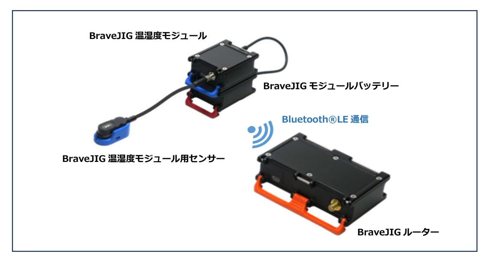
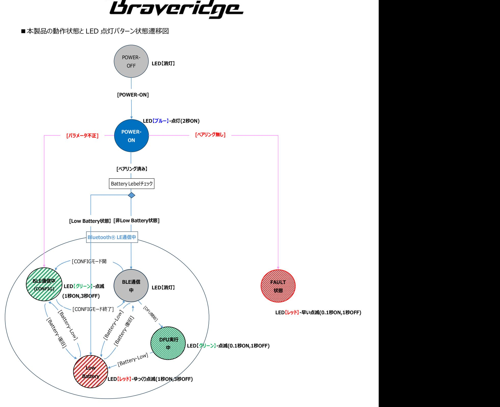
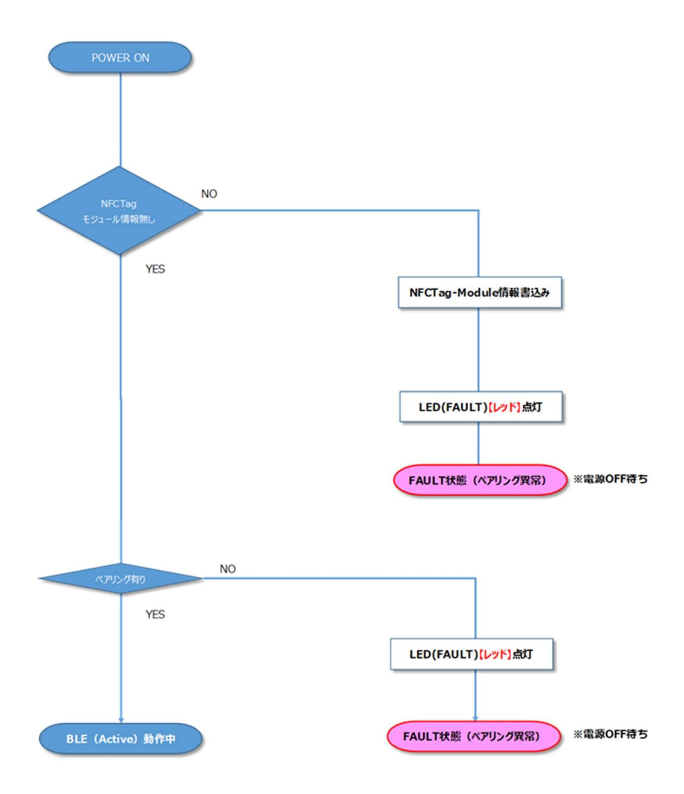
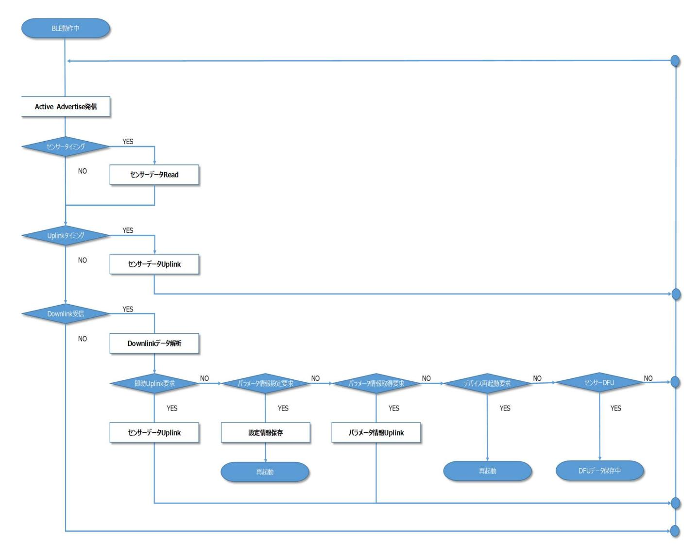
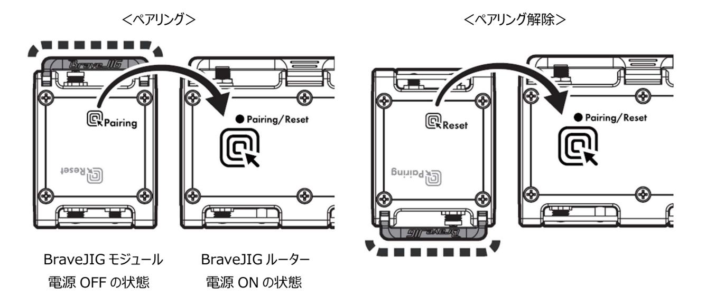

# ソフトウェア仕様書

## BraveJIG 温湿度モジュール

## BJ-MD-TH-01

## ファームウェア

## REV 1.0

DESIGNED BY Braveridge Co., Ltd.

| 1.概要  4                                     |  |
|---------------------------------------------|--|
| 1-1 対象ハードウェア  4                             |  |
| 1-2 機能概要 5                                  |  |
| 2.機能説明  6                                   |  |
| 2-1 センサーデータ取得機能  6                          |  |
| 2-1-1 計測モード  6                              |  |
| 2-2 LED 表示機能  7                             |  |
| 2-3 Bluetooth®LE 通信(Uplink/Downlink)  9     |  |
| 2-3-1 Uplink  9 2-3-2 Downlink  9        |  |
| 2-4 NFC ペアリング機能  9                          |  |
| 2-4-1 NFC ペアリング操作時の本製品の向きの検知  9             |  |
| 2-5 バッテリー残量監視  10                           |  |
| 2-6 ペアリング判定機能【電源 ON 時のみ】  10                |  |
| 2-7 パラメータ設定情報の変更/取得機能  10                   |  |
| 2-7-1 パラメータ設定情報の変更方法について  10                |  |
| 2-7-2 パラメータ設定情報の取得方法について  10                |  |
| 2-7-3 変更可能なパラメータについて  10                    |  |
| 2-8 DFU 機能  10                              |  |
| 2-9 デバイス再起動(リセット)機能  11                     |  |
| 3.パラメータ情報  12                               |  |
| 4.動作フロー  16                                 |  |
| 4-1 動作フロー【電源 ON 時】  16                      |  |
| 4-2 動作フロー【通常動作中(Bluetooth®LE 通信中)】  17      |  |
| 5.Uplink データ仕様  18                          |  |
| 5-1 センサー情報  18                              |  |
| 5-2 パラメータ情報 18                              |  |
| 6.Downlink データ仕様  19                        |  |
| 6-1 即時 Uplink 要求  19                        |  |
| 6-2 パラメータ情報設定要求  19                         |  |
| 6-3 センサーDFU 要求  19                          |  |
| 6-5 デバイス再起動要求  21                           |  |
| 7.電池駆動時(Bluetooth®LE 通信時)の各設定における電池持ち時間  22 |  |
|                                             |  |

| 8.製品到着から使用開始までの流れ  23                              |  |
|----------------------------------------------------|--|
| 8-1 BraveJIG 温湿度モジュールと BraveJIG ルーターのペアリング登録  23   |  |
| 8-2 BraveJIG 温湿度モジュールと BraveJIG ルーターの機器接続と利用開始  23 |  |
| 9.DFU ファイルの入手先  23                                 |  |
| 10.Revision 管理  24                                 |  |

#### 1.概要

本仕様書は、BraveJIG 温湿度モジュールに使用するファームウェア(以降、本製品とする)のソフトウェア仕様を記載したもの です。

#### 1-1 対象ハードウェア

本仕様書の対象とするハードウェアを以下に示します。

<BraveJIG 温湿度モジュール>

| 製品名               | 型番          |
|-------------------|-------------|
| BraveJIG 温湿度モジュール | BJ-MD-TH-01 |

<BraveJIG センサー>

| 製品名                    | 型番           |
|------------------------|--------------|
| BraveJIG 温湿度モジュール用センサー | BJ-MDS-TH-01 |

#### 1-2 機能概要

BraveJIG 温湿度モジュールは、事前にペアリング登録された BraveJIG ルーターに BraveJIG 温湿度モジュール本体に 接続されている BraveJIG 温湿度モジュール用センサーから取得したセンサー値(温湿度)を Bluetooth®LE 通信を 介して上位アプリケーションなどにアップリンクデータとして送信します。

また、モジュール本体への給電方式としては、設置場所や利用形態に応じてバッテリー給電か外部給電(モジュールケーブ ル接続など)のどちらかを選択して給電することが可能です。

【Bluetooth®LE 通信(バッテリー給電時)】

#### 【Bluetooth®LE 通信(外部給電)】

#### 2.機能説明

#### 2-1 センサーデータ取得機能

本製品は、接続した温湿度センサーの値を送信することができます。

| センサーIC | センサーメーカー  |
|--------|-----------|
| SHTC3  | SENSIRION |

#### 2-1-1 計測モード

本製品は以下の計測モードで温湿度センサーの情報を取得することができます。

| 測定モード     | 説明                                           |                 |  |  |  |
|-----------|----------------------------------------------|-----------------|--|--|--|
| 瞬時値モード    | Uplink タイミング時に現在のセンサー測定値を取得し通知します。           |                 |  |  |  |
| 検知モード     | 指定されたサンプリング周期(周波数)(後述のサンプリングモードの記載を参照)       |                 |  |  |  |
|           | 毎にセンサー測定値を取得し、下記に示すパラメータで設定された閾値によるヒステリ      |                 |  |  |  |
|           | シス検知(High 側超えを検知/Low 側復帰を検知)をした場合に通知します。温 |                 |  |  |  |
|           | 湿度センサーでは、温度(℃)と湿度(%)の2つのセンサー測定値が取得される        |                 |  |  |  |
|           | ためにヒステリシス値指定(検知/復帰)時の設定範囲は、温度(℃)と湿度          |                 |  |  |  |
|           | (%)の各々で以下の通りに別々に設定します。                       |                 |  |  |  |
|           | 項目                                           | 設定              |  |  |  |
|           | 温度ヒステリシス値(High)                              | -40℃ ~ +125℃(注) |  |  |  |
|           | 温度ヒステリシス値(Low)                               | -40℃ ~ +125℃(注) |  |  |  |
|           | 湿度ヒステリシス値(High)                              | 0% ~ 100%       |  |  |  |
|           | 湿度ヒステリシス値(Low)                               | 0% ~ 100%       |  |  |  |
|           | 注:センサー測定値として設定可能な温度値の範囲は上記の通りですが、モジュール       |                 |  |  |  |
|           | 本体を含む製品の動作保証範囲は-10℃~50℃です。                   |                 |  |  |  |
| サンプリングモード | 指定したサンプリング周期(周波数)で連続的に収集したセンサー測定値を通知し        |                 |  |  |  |
|           | ます。サンプリングモード時(検知モード時も同様)の設定可能なサンプリング周期       |                 |  |  |  |
|           | (周波数)は以下になります。                               |                 |  |  |  |
|           | 項目                                           | 設定              |  |  |  |
|           | サンプリング周期(周波数)                                | 1,000ms(1Hz)    |  |  |  |
|           |                                              | 500ms(2Hz)      |  |  |  |
|           | 各サンプリングモード時の最大 Uplink 周期は以下になります。            |                 |  |  |  |
|           | サンプリング周期(周波数)                                | 最大 Uplink 間隔    |  |  |  |
|           | 1,000ms(1Hz)                                 | 5000 秒          |  |  |  |
|           | 500ms(2Hz)                                   | 2500 秒          |  |  |  |

#### 2-2 LED 表示機能

本製品の動作状態を以下の様に LED 点灯パターンで表示します。

■本製品の動作状態と LED 点灯パターン表

| 優先 | 状態                | LED(発光色) |     |      | 備考                 |
|----|-------------------|----------|-----|------|--------------------|
|    |                   | レッド      | ブルー | グリーン |                    |
| 高  | LowBattery 状態     | 点滅       | -   | -    | 1 秒点灯、3 秒消灯を繰り返す   |
|    | ペアリング FAULT 状態 ※1 | 点滅       | -   | -    | 0.1 秒点灯、1 秒消灯を繰り返す |
|    | DFU 実行中 ※2        | -        | -   | 点滅   | 0.1 秒点灯、1 秒消灯を繰り返す |
|    | PowerON           | -        | 点灯  | -    | 2 秒点灯→消灯           |
| 低  | 上記以外(通常動作中)       | -        | -   | -    | 無灯                 |

※1:電源 ON 時にペアリング異常を検出時に点灯する(ペアリング無し/不一致、NFC メモリ異常など)

※2:DFU 実行中(DFU データ受信開始~DFU データ FLASH 書き込み中)のみ点滅する

■本製品の動作状態と LED 点灯パターン状態遷移図

#### 2-3 Bluetooth®LE 通信(Uplink/Downlink)

本製品はモジュール本体に接続されたモジュール用温湿度センサーから取得したセンサー情報(温度(℃)、湿度 (%))を、無線通信(Bluetooth® LE 通信)を介して Uplink データとして BraveJIG ルーターに通知します。 また、逆に BraveJIG ルーター経由で本製品に対してパラメータ設定値の取得/変更や DFU 実行などの指示を Downlink コマンドにより制御することも可能です。

#### 2-3-1 Uplink

以下の情報を Uplink することができます。

| Uplink 情報 | Uplink タイミング               |  |  |  |
|-----------|----------------------------|--|--|--|
| センサーデータ   | パラメータで指定された Uplink 間隔      |  |  |  |
| パラメータ情報   | Downlink でパラメータ情報取得要求された場合 |  |  |  |
|           |                            |  |  |  |

詳細については、「5.Uplink データ仕様」を参照。

#### 2-3-2 Downlink

以下の指示を Downlink することができます。

| Downlink 情報  | 動作概要                                    |
|--------------|-----------------------------------------|
| 即時 Uplink 要求 | 現在のセンサー情報の Uplink を要求します。               |
| パラメータ情報設定要求  | 本製品のパラメータ情報を設定します。                      |
| パラメータ情報取得要求  | 本製品のパラメータ情報の Uplink を要求します。             |
| センサーDFU 要求   | 本製品の DFU 用ファイルで F/W アップデートの実行を要求します。 |
| デバイス再起動      | 本製品へ再起動を要求します。                          |

詳細については、「6.Downlink データ仕様」を参照。

#### 2-4 NFC ペアリング機能

本製品は、NFC-Tag チップ「NFC/RFID Dinamic TAG IC(ST25DV04KCS)」と NFC アンテナを内蔵しており、 本製品を BraveJIG ルーターの NFC アンテナの(ホール素子 1,2)へかざすことで、BraveJIG ルーターと本製品の ペアリング登録/解除が簡単に行えます。

なお、本製品と BraveJIG ルーターとの間でのペアリング登録操作時には、前述の NFC-Tag チップ内の不揮発メモリに ペアリング情報の書き込みが行われ、逆にペアリング解除操作時にはペアリング登録の際に書込まれた NFC-Tag チップ内 の不揮発メモリ内のペアリング情報の消去を行います。

#### 2-4-1 NFC ペアリング操作時の本製品の向きの検知

本製品は、上面ケースには NFC アンテナに加えてペアリング操作時の方向(正方向/逆方向)を BraveJIG ルーターが 検知するための磁石を内蔵しています。

また、これに対して BraveJIG ルーターには、この磁石を検知してペアリング操作時の本製品の向きを判別するためのホール 素子をケース上面の NFC アンテナ部分に内蔵しています。

BraveJIG ルーターは以下で示す様に前述のホール素子で検知した本製品の向きによってペアリング登録/ペアリング解除 を判断してペアリング情報の書き込み/消去を行います。

| 操作      | ホール素子 ※    | 備考              |
|---------|------------|-----------------|
| ペアリング登録 | ホール素子 1 ※1 | ペアリング情報を書き込みます。 |
| ペアリング解除 | ホール素子 2 ※1 | ペアリング情報を消去します。  |

※1 ホール素子 1:ルーター天面上方(正方向)、ホール素子 2:ルーター天面下方(逆方法) 詳細は、「8.製品到着から使用開始までの流れ」を参照お願いします。

#### 2-5 バッテリー残量監視

本製品では、バッテリー電圧を1分周期で監視してバッテリー残量(%)の算出を行います。このため、本製品のバッテリー 残量(%)の更新周期は上記の監視周期(1 分)となります。

なお、バッテリー残量(%)は Uplink データ(センサー情報)により上位アプリケーションなどで確認することが可能であり、 本製品の LED 表示でも LowBattery 状態(レッド色の LED が点滅する)か否を目視確認することも可能です。

#### 2-6 ペアリング判定機能【電源 ON 時のみ】

本製品では、モジュール本体の電源 ON シーケンスにおいて NFCTag チップ内のペアリング情報の読み出しを行って Bluetooth®LE 通信モードによる動作を開始するか、或いは FAULT 状態(ペアリング無し時や NFCTag チップ故障 などにより動作ができない状態)に遷移するかを判定します。

#### ■ペアリング判定結果によるモジュール動作

| 通信モード判定結果      | 動作モード(次動作)          | 備考                        |
|----------------|---------------------|---------------------------|
| ①ペアリング情報無し     | FAULT 状態(ペアリング異常)   | NFCTag チップ内のペアリング情報(ルーター情 |
|                |                     | 報)が無い場合                   |
| ②ペアリング情報有り     | Bluetooth® LE 通信モード | 但し、ペアリング先のルーターが通信圏外の場合    |
|                |                     | は通信不可となる                  |
| ③NFC-Tag チップ異常 | FAULT 状態(故障)        | NFCTag チップ内のペアリング情報が読み出せ  |
|                |                     | ない場合(チップ故障など)             |

#### 2-7 パラメータ設定情報の変更/取得機能

本製品のパラメータ情報の変更/取得することができます。

#### 2-7-1 パラメータ設定情報の変更方法について

本製品のパラメータ設定情報の変更は以下の方法で行います。

上位アプリケーションなどから BraveJIG ルーターを介して Downlink コマンド(パラメータ情報設定要求)を送信すること でパラメータ情報を変更することができます。

#### 2-7-2 パラメータ設定情報の取得方法について

本製品のパラメータ情報の設定は以下の方法で行います。

上位アプリケーションなどから BraveJIG ルーターを介して Downlink コマンド(パラメータ情報取得要求)をすることによ り、UpLink データ(パラメータ情報)でパラメータ情報を取得することができます。

#### 2-7-3 変更可能なパラメータについて

本製品の変更/取得可能なパラメータに関しては「3.パラメータ情報」を参照下さい。

#### 2-8 DFU 機能

本製品の DFU(ダウンロードファームウェアアップデート)は以下の方法で行えます。

上位アプリケーションなどから BraveJIG ルーターを介して Downlink コマンド(センサーDFU)を送信することでファーム ウェアアップデートを実行することができます。

なお、DFU を実行する際において、本製品のバッテリー残量が既に Low Battery 状態である場合は、DFU の実行は 拒否(センサーDFU コマンドの送信に対してエラー応答)されます。

また、本製品に対する DFU の実行中(DFU データのダウンロード中)に Low Battery 状態が検出された場合も同様に DFU データのダウンロードを中止して DFU を強制終了します。

#### 2-9 デバイス再起動(リセット)機能

本製品のデバイス再起動は以下の方法で行えます。上位アプリケーションなどから BraveJIG ルーターを介して Downlink コマンド(デバイス再起動要求)を本製品に送信することで本製品のデバイス再起動が行えます。

#### 3.パラメータ情報

本製品のパラメータを以下に示します。

| カテゴリ      | 項目                 | サイズ   | 設定情報                                |                                 |  |  |
|-----------|--------------------|-------|-------------------------------------|---------------------------------|--|--|
| BraveGATE | BraveGATE          | 6byte | BraveJIG ルーターと通信する為に必要な             |                                 |  |  |
|           | CompanyID          |       | CompanyID                           |                                 |  |  |
|           | BraveGATE DeviceID | 8byte | BraveJIG ルーターと通信する為に必要な DeviceID    |                                 |  |  |
|           | BraveGATE SensorID | 2byte | BraveJIG ルーターと通信する為に必要な SensorID    |                                 |  |  |
|           |                    |       | 本製品の SensorID は【0x123】固定とする         |                                 |  |  |
| デバイス設定    | タイムゾーン設定           | 1byte | タイムゾーン設定に関する設定情報を以下に示します            |                                 |  |  |
|           |                    |       | 設定値                                 | 説明                              |  |  |
|           |                    |       | 0x00                                | 日本時間                            |  |  |
|           |                    |       | 0x01                                | UTC                             |  |  |
|           |                    |       | 上記以外                                | 日本時間                            |  |  |
|           |                    |       | 【初期値:0x01(UTC)】                     |                                 |  |  |
|           | BLE Mode           | 1byte | Bluetooth® LE 通信モードの設定情報を以下に示し      |                                 |  |  |
|           |                    |       | ます                                  |                                 |  |  |
|           |                    |       | 設定値                                 | 説明                              |  |  |
|           |                    |       | 0x00                                | LongRange                       |  |  |
|           |                    |       | 0x01                                | Legacy                          |  |  |
|           |                    |       | 上記以外                                | LongRange                       |  |  |
|           |                    |       | 【初期値:0x00(LongRange)】               |                                 |  |  |
|           |                    |       | ※Bluetooth® LE 通信モードは、BraveJIG ルーター |                                 |  |  |
|           |                    |       | と同じ通信モードに設定すること                     |                                 |  |  |
|           |                    |       |                                     | ※Bluetooth® LE 通信モードを変更する際は、最初に |  |  |
|           |                    |       | 本製品の設定値を変更し、その後 BraveJIG ルーター       |                                 |  |  |
|           |                    |       | の設定を同じ通信モードの設定値に変更すること              |                                 |  |  |
|           | Tx Power           | 1byte | Bluetooth® LE 通信の送信電波出力の設定情報を       |                                 |  |  |
|           |                    |       | 以下に示します                             |                                 |  |  |
|           |                    |       | 設定値                                 | 説明                              |  |  |
|           |                    |       | 0x00                                | ±0dBm                           |  |  |
|           |                    |       | 0x01                                | +4dBm                           |  |  |
|           |                    |       | 0x02                                | -4dBm                           |  |  |
|           |                    |       | 0x03                                | -8dBm                           |  |  |
|           |                    |       | 0x04                                | -12dBm                          |  |  |
|           |                    |       | 0x05                                | -16dBm                          |  |  |
|           |                    |       | 0x06                                | -20dBm                          |  |  |
|           |                    |       | 0x07                                | -40dBm                          |  |  |
|           |                    |       | 0x08                                | +8dBm                           |  |  |
|           |                    |       | 上記以外                                | ±0dBm                           |  |  |
|           |                    |       | 【初期値:0x00(±0dBm)】                   |                                 |  |  |

| <b>Braveridge</b> |  |
|-------------------|--|
|                   |  |

| カテゴリ   | 項目                 | サイズ   | 設定情報                                                                |  |                                                   |
|--------|--------------------|-------|---------------------------------------------------------------------|--|---------------------------------------------------|
| デバイス設定 | Advertise Interval | 2byte | Advertise を発信する間隔を設定する                                              |  |                                                   |
|        |                    |       | 設定値                                                                 |  | 説明                                                |
|        |                    |       | 0x0064                                                              |  | 100ms 周期に Advertise を発信する                         |
|        |                    |       | :                                                                   |  | :                                                 |
|        |                    |       | 0x03E8                                                              |  | 1,000ms 周期に Advertise を発信する                       |
|        |                    |       | :                                                                   |  | :                                                 |
|        |                    |       | 0x2710                                                              |  | 10,000ms 周期に Advertise を発信する                      |
|        |                    |       | 上記以外                                                                |  | 1,000ms 周期に Advertise を発信する                       |
|        |                    |       |                                                                     |  | 【初期値:0x0064(100ms)】                               |
|        | Sensor Uplink      | 4byte |                                                                     |  | センサー情報データを Uplink する間隔を設定する                       |
|        | Interval           |       |                                                                     |  | ■計測モードが「瞬時値モード」の場合                                |
|        |                    |       | 設定値                                                                 |  | 説明                                                |
|        |                    |       | 0x00000001                                                          |  | 5 秒以下は、5 秒周期に Sensor 情                            |
|        |                    |       |                                                                     |  | 報データを Uplink します                                  |
|        |                    |       | :                                                                   |  | :                                                 |
|        |                    |       | 0x00000005                                                          |  | 5 秒周期に Sensor 情報データを                              |
|        |                    |       |                                                                     |  | Uplink します                                        |
|        |                    |       | :                                                                   |  | :                                                 |
|        |                    |       | 0x0000003C                                                          |  | 60 秒周期に Sensor 情報データを                             |
|        |                    |       |                                                                     |  | Uplink します                                        |
|        |                    |       | :                                                                   |  | :                                                 |
|        |                    |       | 0x00000E10                                                          |  | 3,600 秒(1 時間)周期に Sensor                           |
|        |                    |       |                                                                     |  | 情報データを Uplink します                                 |
|        |                    |       | :                                                                   |  | :                                                 |
|        |                    |       | 0x00015180                                                          |  | 86,400 秒(24 時間)周期に                                |
|        |                    |       |                                                                     |  | Sensor 情報データを Uplink します 60 秒周期に Sensor 情報データを |
|        |                    |       | 上記以外                                                                |  | Uplink します                                        |
|        |                    |       |                                                                     |  |                                                   |
|        |                    |       | 【初期値:0x0000003C(60 秒)】 ■計測モードが「検知モード」の場合(全デバイス共通)本設 定は無視されます。 |  |                                                   |
|        |                    |       |                                                                     |  |                                                   |
|        |                    |       |                                                                     |  |                                                   |
|        |                    |       |                                                                     |  |                                                   |
|        |                    |       | ■計測モードが「サンプリングモード」の場合                                               |  |                                                   |
|        |                    |       | 設定値                                                                 |  | 説明                                                |
|        |                    |       | 0x0000003C                                                          |  | 60 秒周期に Sensor 情報データを                             |
|        |                    |       |                                                                     |  | Uplink します                                        |
|        |                    |       | :                                                                   |  | :                                                 |
|        |                    |       | 0x00000E10                                                          |  | 3,600 秒(1 時間)周期に Sensor                           |
|        |                    |       |                                                                     |  | 情報データを Uplink します                                 |
|        |                    |       | :                                                                   |  | :                                                 |

| 0x00015180 | 86,400 秒(24 時間)周期に       |
|------------|--------------------------|
|            | Sensor 情報データを Uplink します |
| :          | :                        |
| 上記以外       | 60 秒周期に Sensor 情報データを    |
|            | Uplink します。              |
|            | 【初期値:0x0000003C(60 秒)】   |

| カテゴリ | 項目       | サイズ   | 設定情報                            |    |                                 |  |
|------|----------|-------|---------------------------------|----|---------------------------------|--|
| センサー | 計測モード    | 1byte | 当該センサー情報の計測モードを設定する             |    |                                 |  |
| 個別情報 |          |       | 設定値                             |    | 説明                              |  |
|      |          |       | 0x00                            |    | 瞬時値モード:Uplink タイミング時の現在         |  |
|      |          |       |                                 |    | の値を通知する                         |  |
|      |          |       | 0x01                            |    | 検知モード:ヒステリシス検知したことを通知           |  |
|      |          |       |                                 | する |                                 |  |
|      |          |       | 0x02                            |    | サンプリングモード:指定したサンプリング周           |  |
|      |          |       |                                 |    | 期(周波数)で蓄積データを通知する               |  |
|      |          |       | 上記以外                            |    | 瞬時値モードになります                     |  |
|      |          |       |                                 |    | 【初期値:0x00(瞬時値モード)】              |  |
|      | サンプリング周期 | 1byte | 検知モード、またはサンプリングモード時に指定されたサンプリング |    |                                 |  |
|      | (周波数)    |       | 周期(周波数)でセンサー測定を実行します。設定可能なサ     |    |                                 |  |
|      |          |       |                                 |    | ンプリング周期(周波数)は以下とします             |  |
|      |          |       | 設定値                             |    | 説明                              |  |
|      |          |       | 0x00                            |    | 1,000ms 周期(1Hz)にセンサー情報を         |  |
|      |          |       |                                 |    | Read します                        |  |
|      |          |       | 0x01                            |    | 500ms 周期(2Hz)にセンサー情報を           |  |
|      |          |       |                                 |    | Read します                        |  |
|      |          |       | 上記以外                            |    | 1,000ms 周期(1Hz)設定になります          |  |
|      |          |       | 【初期値:0x00(1,000ms(1Hz))】        |    |                                 |  |
|      | 温度ヒステリシス | 4byte |                                 |    | 温度センサー情報の High 側のヒステリシスを設定する(設定 |  |
|      | (High)   |       | 値の詳細は下記を参照)                     |    |                                 |  |
|      |          |       | 設定値                             |    | 備考                              |  |
|      |          |       | :                               |    | -40℃以下は-40℃に丸められます              |  |
|      |          |       | 0xFFFFFFD8                      |    | -40℃                            |  |
|      |          |       | :                               |    | :                               |  |
|      |          |       | 0xFFFFFFFF                      |    | -1℃                             |  |
|      |          |       | 0x00000000                      |    | ±0℃                             |  |
|      |          |       | 0x00000001                      |    | +1℃                             |  |
|      |          |       | :                               |    | :                               |  |
|      |          |       | 0x0000007D                      |    | +125℃                           |  |
|      |          |       | :                               |    | +125℃以上は+125℃に丸められま             |  |
|      |          |       |                                 |    | す                               |  |
|      |          |       |                                 |    | 【初期値:0x0000001E(+30℃)】          |  |

| <b>Braveridge</b> |  |
|-------------------|--|
|                   |  |

| 温度ヒステリシス | 4byte | 温度センサー情報の Low 側のヒステリシスを設定する(設定                |                                 |
|----------|-------|-----------------------------------------------|---------------------------------|
| (Low)    |       | 値の詳細は下記を参照)                                   |                                 |
|          |       | 設定値                                           | 備考                              |
|          |       | :                                             | -40℃以下は-40℃に丸められます              |
|          |       | 0xFFFFFFD8                                    | -40℃                            |
|          |       | :                                             | :                               |
|          |       | 0xFFFFFFFF                                    | -1℃                             |
|          |       | 0x00000000                                    | ±0℃                             |
|          |       | 0x00000001                                    | +1℃                             |
|          |       | :                                             | :                               |
|          |       | 0x0000007                                     | +125℃                           |
|          |       | :                                             | +125℃以上は+125℃に丸められま             |
|          |       |                                               | す                               |
|          |       |                                               | 【初期値:0x0000000A(+10℃)】          |
|          |       |                                               | ※Low>=High の場合は当該センサー情報のヒステリシスは |
|          |       | 無効となる                                         |                                 |
| 湿度ヒステリシス | 4byte | 湿度センサー情報の High 側のヒステリシスを設定する(設定               |                                 |
| (High)   |       | 値の詳細は下記を参照)                                   |                                 |
|          |       | 設定値                                           | 備考                              |
|          |       | 0x00000000                                    | 0%                              |
|          |       | :                                             | :                               |
|          |       | 0x00000064                                    | 100%                            |
|          |       | :                                             | 100%以上は 100%に丸められます             |
|          |       | 【初期値:0x00000050(80%)】                         |                                 |
| 湿度ヒステリシス | 4byte | 湿度センサー情報の Low 側のヒステリシスを設定する(設定 値の詳細は下記を参照) |                                 |
| (Low)    |       |                                               |                                 |
|          |       | 設定値                                           | 備考                              |
|          |       | 0x00000000                                    | 0%                              |
|          |       | :                                             | :                               |
|          |       | 0x00000064                                    | 100%                            |
|          |       | :                                             | 100%以上は 100%に丸められます             |
|          |       | 【初期値:0x0000003C(60%)】                         |                                 |
|          |       |                                               | ※Low>=High の場合は当該センサー情報のヒステリシスは |
|          |       | 無効となる                                         |                                 |

4.動作フロー

4-1 動作フロー【電源 ON 時】

#### 4-2 動作フロー【通常動作中(Bluetooth®LE 通信中)】

### 5.Uplink データ仕様

BraveJIG 温湿度モジュールから通知される情報ついて以下に示す。

#### 5-1 センサー情報

| 項目          | サイズ (byte) | Data             |                          | 説明       | 備考                  |  |
|-------------|---------------|------------------|--------------------------|----------|---------------------|--|
| SensorID    | 2             | 0x0123           | 温湿度モジュール                 |          | 製品の Sensor ID を設定する |  |
| Sequence No | 2             | 0x0000~0xFFFF    |                          |          |                     |  |
| Sensor Data | 1             | BatteryLevel     | バッテリーレベル(%)              |          |                     |  |
|             | 1             | Sampling         | サンプリング周期(周波数)            |          |                     |  |
|             | 4             | Time             | センサーリード時刻※unsigned int 型 |          | [デバイス設定情]TimeZone   |  |
|             |               |                  | (タイムゾーン時刻)               |          | の時刻                 |  |
|             | 2             | sampleNum        | サンプル数                    |          | リトルエンディアン           |  |
|             | 8             | measuredata[0]   | temperature              | 摂氏(℃)    | リトルエンディアン           |  |
|             |               |                  |                          | ※Float 型 |                     |  |
|             |               |                  | humidity                 | 相対湿度(%)  | リトルエンディアン           |  |
|             |               |                  |                          | ※Float 型 |                     |  |
|             | :             |                  |                          |          |                     |  |
|             | 8             | measureData[n-1] | temperature              | 摂氏(℃)    | リトルエンディアン           |  |
|             |               |                  |                          | ※Float 型 |                     |  |
|             |               |                  | humidity                 | 相対湿度(%)  | リトルエンディアン           |  |
|             |               |                  |                          | ※Float 型 |                     |  |

#### 5-2 パラメータ情報

| 項目          | サイズ (byte) | Data                   | 説明                        | 備考                |
|-------------|---------------|------------------------|---------------------------|-------------------|
| SensorID    | 2             | 0x0000                 | エンドデバイス本体                 |                   |
| Sequence No | 2             | 0xFFFFF                |                           |                   |
| Sensor Data | 2             | SensorID               | 0x0123 固定                 | 本製品に接続されている       |
|             |               |                        |                           | Sensor の SensorID |
|             | 3             | FW Version             | 本製品の FW バージョン             |                   |
|             | 1             | TimeZone               | タイムゾーン設定                  |                   |
|             | 1             | BLE Mode               | Bluetooth® LE 通信モードの設定情報  |                   |
|             | 1             | Tx Power               | Bluetooth® LE 通信の送信電波出力   |                   |
|             | 2             | Advertise Interval     | Advertise を発信する間隔         | リトルエンディアン         |
|             | 4             | Sensor Uplink Interval | Sensor 情報データを Uplink する間隔 | リトルエンディアン         |
|             | 1             | Sensor Read Mode       | 計測モード                     |                   |
|             | 1             | Sampling               | サンプリング周期(周波数)             |                   |
|             | 4             | Temp_HysteresisHigh    | 温度ステリシス(High):温度(℃)       | リトルエンディアン         |
|             |               |                        | ※Int 型                    |                   |
|             | 4             | Temp_HysteresisLow     | 温度ヒステリシス(Low):温度(℃)       | リトルエンディアン         |
|             |               |                        | ※Int 型                    |                   |
|             | 4             | Hum_HysteresisHigh     | 湿度ステリシス(High):湿度(%)       | リトルエンディアン         |
|             |               |                        | ※Int 型                    |                   |
|             | 4             | Hum_HysteresisLow      | 湿度ヒステリシス(Low):温度(%)       | リトルエンディアン         |
|             |               |                        | ※Int 型                    |                   |

### 6.Downlink データ仕様

BraveJIG 温湿度モジュールから送信する情報ついて以下に示します。

#### 6-1 即時 Uplink 要求

| 項目          | サイズ (byte) | Data   | 説明           | 備考                |
|-------------|---------------|--------|--------------|-------------------|
| SensorID    | 2             | 0x0123 | 温湿度モジュール     |                   |
| CMD         | 1             | 0x00   | 即時 Uplink 要求 | SEND_DATA_AT_ONCE |
| Sequence No | 2             | 0xFFFF | 固定           |                   |
| DATA        | ―             | ―      | なし           |                   |

#### 6-2 パラメータ情報設定要求

| 項目          | サイズ (byte) | Data                   | 説明                        | 備考                 |
|-------------|---------------|------------------------|---------------------------|--------------------|
| SensorID    | 2             | 0x0000                 | エンドデバイス本体                 |                    |
| CMD         | 1             | 0x05                   | Reg 設定                    | SET_REGISTER       |
| Sequence No | 2             | 0xFFFF                 | 固定                        |                    |
| DATA        | 2             | SensorID               | 0x0123 固定                 | 本製品に接続されている Sensor |
|             |               |                        |                           | の SensorID         |
|             | 1             | TimeZone               | タイムゾーン設定                  |                    |
|             | 1             | BLE Mode               | Bluetooth® LE 通信モードの設定情   |                    |
|             |               |                        | 報                         |                    |
|             | 1             | Tx Power               | Bluetooth® LE 通信の送品電波出力   |                    |
|             | 2             | Advertise Interval     | Advertise を発信する間隔         | リトルエンディアン          |
|             | 4             | Sensor Uplink Interval | Sensor 情報データを Uplink する間隔 | リトルエンディアン          |
|             | 1             | Sensor Read Mode       | 計測モード                     |                    |
|             | 1             | Sampling               | サンプリング周期(周波数)             |                    |
|             | 4             | Temp_HysteresisHigh    | 温度ステリシス(High):温度(℃)       | リトルエンディアン          |
|             |               |                        | ※Int 型                    |                    |
|             | 4             | Temp_HysteresisLow     | 温度ヒステリシス(Low):温度(℃)       | リトルエンディアン          |
|             |               |                        | ※Int 型                    |                    |
|             | 4             | Hum_HysteresisHigh     | 湿度ステリシス(High):湿度(%)       | リトルエンディアン          |
|             |               |                        | ※Int 型                    |                    |
|             | 4             | Hum_HysteresisLow      | 湿度ヒステリシス(Low):温度(%)       | リトルエンディアン          |
|             |               |                        | ※Int 型                    |                    |

#### 6-3 センサーDFU 要求

#### 【基本フォーマット(Sequence No = 0x0000~xFFFF)】

| 項目          | サイズ (byte) | Data          | 説明                 | 備考                     |
|-------------|---------------|---------------|--------------------|------------------------|
| SensorID    | 2             | 0x0123        | 温湿度モジュール           |                        |
| CMD         | 1             | 0x12          | センサーDFU            | UPDATE_SENSOR_FIRMWARE |
| Sequence No | 2             | 0x0000~0xFFFF | 固定                 | リトルエンディアン              |
| DATA※       | 1~238         | 各転送ブロック       | DFU データ(分割バイナリデータ) | ・DFU データ転送ブロックサイズ      |
|             |               | (Sequence No  |                    | (Max)=Max238byte       |
|             |               | 毎)にデータの設定フォ   |                    | ・DFU データは転送ブロック(先頭/    |
|             |               | ーマットが異なる      |                    | 継続/最終)毎に下記示すフォーマッ      |
|             |               | ※詳細は後述を参照     |                    | トでデータを設定する             |

計 6~243(Max)byte

#### 【先頭ブロック(Sequence No = 0x0000)】

| 項目          | サイズ (byte) | Data       | 説明             | 備考                     |
|-------------|---------------|------------|----------------|------------------------|
| SensorID    | 2             | 0x0123     | 温湿度モジュール       |                        |
| CMD         | 1             | 0x12       | センサーDFU        | UPDATE_SENSOR_FIRMWARE |
| Sequence No | 2             | 0x0000     | 先頭ブロック(DFU 開始) | リトルエンディアン              |
| DATA        | 2             | hardwareID | 0x0000:固定      | リトルエンディアン              |
|             |               | [2byte]    |                |                        |
|             | 236           | Reserve    | 0xFF 埋め        |                        |

計 243byte

#### 【第 2 ブロック(Sequence No = 0x0001)】

| 項目          | サイズ (byte) | Data          | 説明                      | 備考                     |
|-------------|---------------|---------------|-------------------------|------------------------|
| SensorID    | 2             | 0x0123        | 温湿度モジュール                |                        |
| CMD         | 1             | 0x12          | センサーDFU                 | UPDATE_SENSOR_FIRMWARE |
| Sequence No | 2             | 0x0001        | 第 2 ブロック(DFU データ⾧+先頭 | リトルエンディアン              |
|             |               |               | DFU データ)                |                        |
| DATA        | 4             | dfuDataLength | DFU データ⾧(CRC データ含む)     | リトルエンディアン              |
|             | 234           | dfuDataBody   | DFU データ(バイナリ Body)      |                        |

計 243byte

#### 【第 3 ブロック以降~最終ブロック直前まで(Sequence No = 0x0002~0xXXX)】

| 項目          | サイズ(byte) | Data          | 説明                  | 備考                     |
|-------------|-----------|---------------|---------------------|------------------------|
| SensorID    | 2         | 0x0123        | 温湿度モジュール            |                        |
| CMD         | 1         | 0x12          | センサーDFU             | UPDATE_SENSOR_FIRMWARE |
| Sequence No | 2         | 0x0002~0xXXXX | 第 3 ブロック以降:継続データ | リトルエンディアン              |
|             |           |               | (DFU データのみ)         |                        |
| DATA        | 238       | dfuDataBody   | DFU データ(バイナリ Body)  |                        |
|             |           | [240byte]     |                     |                        |

計 243byte

#### 【最終ブロック(Sequence No = 0xFFFF)】

| 項目          | サイズ (byte) | Data          | 説明                     | 備考                     |
|-------------|---------------|---------------|------------------------|------------------------|
| SensorID    | 2             | 0x0123        | 温湿度モジュール               |                        |
| CMD         | 1             | 0x12          | センサーDFU                | UPDATE_SENSOR_FIRMWARE |
| Sequence No | 2             | 0xFFFF        | 最終ブロック:継続データ(DFU デー    | リトルエンディアン              |
|             |               |               | タ)                     |                        |
| DATA        | 0~234         | dfuDataBody   | DFU データ(バイナリ Body)     |                        |
|             |               | [n byte]      |                        |                        |
|             | 4             | dfuCrc[4byte] | DFU データ(DFU バイナリ Body) | リトルエンディアン              |

計 6~243(Max)byte

#### 6-4 パラメータ情報取得要求

| 項目       | サイズ (byte) | Data   | 説明         | 備考                 |
|----------|---------------|--------|------------|--------------------|
| SensorID | 2             | 0x0000 | エンドデバイス本体  |                    |
| CMD      | 1             | 0x0D   | デバイス情報取得要求 | GET_DEVICE_SETTING |

| Sequence No | 2 | 0xFFFF | 固定          |  |
|-------------|---|--------|-------------|--|
|             |   |        |             |  |
|             |   |        |             |  |
|             |   |        |             |  |
|             |   |        |             |  |
|             |   |        |             |  |
|             |   |        |             |  |
| DATA        | 1 | 0x00   | パラメータ情報取得要求 |  |

#### 6-5 デバイス再起動要求

| 項目          | サイズ (byte) | Data   | 説明        | 備考      |
|-------------|---------------|--------|-----------|---------|
| SensorID    | 2             | 0x0000 | エンドデバイス本体 |         |
| CMD         | 1             | 0xFD   | デバイス再起動   | RESTART |
| Sequence No | 2             | 0xFFFF | 固定        |         |
| DATA        | ―             | ―      | なし        |         |

### 7.電池駆動時(Bluetooth®LE 通信時)の各設定における電池持ち時間

BraveJIG 温湿度モジュールの電池駆動時における代表的な設定値に対するおおよその電池持ち時間を以下に示します。

| <bluetooth®le の場合="" 通信モード:legacy=""></bluetooth®le> |           |         |          |           |      |  |  |
|------------------------------------------------------|-----------|---------|----------|-----------|------|--|--|
|                                                      | パラメータ設定情報 |         |          |           |      |  |  |
| 計測モード                                                | サンプリング    | TxPower | Uplink   | Advertise | ※参考値 |  |  |
|                                                      | 周期(周波数)   |         | Interval | Interval  |      |  |  |
| 瞬時値モード                                               | -         | 0dBm    | 5 秒      | 100ms     | 290  |  |  |
|                                                      |           |         |          | 1,000ms   | 436  |  |  |
|                                                      |           |         | 10 秒     | 100ms     | 367  |  |  |
|                                                      |           |         |          | 1,000ms   | 620  |  |  |
|                                                      |           |         | 60 秒     | 100ms     | 460  |  |  |
|                                                      |           |         |          | 1,000ms   | 1096 |  |  |
| 検知モード/                                               | 1,000ms   | 0dBm    | 60 秒     | 100ms     | 192  |  |  |
| サンプリングモード                                            | (1Hz)     |         |          | 1,000ms   | 252  |  |  |
|                                                      | 500ms     | 0dBm    | 60 秒     | 100ms     | 139  |  |  |
|                                                      | (2Hz)     |         |          | 1,000ms   | 174  |  |  |

※参考値:BraveJIG モジュールバッテリー2×2 使用時

#### <Bluetooth®LE 通信モード:LongRange の場合>

| パラメータ設定情報 |                   |         |                    |                       |      |
|-----------|-------------------|---------|--------------------|-----------------------|------|
| 計測モード     | サンプリング 周期(周波数) | TxPower | Uplink Interval | Advertise Interval | ※参考値 |
| 瞬時値モード    | -                 | 0dBm    | 5 秒                | 100ms                 | 96   |
|           |                   |         |                    | 1,000ms               | 152  |
|           |                   |         | 10 秒               | 100ms                 | 124  |
|           |                   |         |                    | 1,000ms               | 229  |
|           |                   |         | 60 秒               | 100ms                 | 171  |
|           |                   |         |                    | 1,000ms               | 563  |
| 検知モード/    | 1,000ms (1Hz)  | 0dBm    | 60 秒               | 100ms                 | 114  |
| サンプリングモード |                   |         |                    | 1,000ms               | 229  |
|           | 500ms (2Hz)    | 0dBm    | 60 秒               | 100ms                 | 97   |
|           |                   |         |                    | 1,000ms               | 173  |

※参考値:BraveJIG モジュールバッテリー2×2 使用時

#### 8.製品到着から使用開始までの流れ

#### 8-1 BraveJIG 温湿度モジュールと BraveJIG ルーターのペアリング登録

BraveJIG 温湿度モジュールと BraveJIG ルーターのペアリング登録手順について以下に示します。

- 1 BraveJIG ルーターを電源 ON の状態にしておく。
- 2 BraveJIG 温湿度モジュールを電源 OFF 状態(モジュール用バッテリーやモジュールケーブルで給電しない)にする。
- 3 BraveJIG 温湿度モジュールの天面(NFC アンテナ)の「Pairing」の印刷が、BraveJIG ルーター天面(同じく NFC アンテナ)の「Pairing/Reset」の印刷と同じ方向に向けた状態で BraveJIG 温湿度モジュールを裏返して、両製品の 天面同士が重なるようにしてペアリング登録を行う。

モジュールは、必ず取付ベース等から外し、単体かつ電源 OFF の状態で操作して下さい。 複数のモジュールを横に並べた状態でペアリング操作を行うと、一部のモジュールが正常にペアリング登録されず、 ルーターとの通信ができなくなる恐れがあります。

4 BraveJIG ルーターからの音声ガイダンス「ペアリングが完了しました」により、ペアリングが正常に行われた事を確認する。 以上でペアリング登録の作業は終了です。

#### 8-2 BraveJIG 温湿度モジュールと BraveJIG ルーターの機器接続と利用開始

BraveJIG 温湿度モジュールと BraveJIG ルーターの接続手順について以下に示します。

- 1 BraveJIG 温湿度モジュールにセンサーを接続する(事前に BraveJIG 温湿度センサーが接続されていない場合の み)。
- 2 BraveJIG 温湿度モジュールを電源 ON 状態(モジュール用バッテリーやモジュールケーブルに接続する)にする。
- 3 BraveJIG 温湿度モジュールの電源 ON 起動時の LED 表示(ブルー:2 秒 ON→消灯)から LED が全消灯となり 通常動作状態となる事を確認する。

以上で機器接続の作業は終了です(機器の利用開始状態になります)。

### 9.DFU ファイルの入手先

本製品の DFU ファイルは、BraveJIG サイト[サポート]ー[ソフトウェア]から入手が可能です。 BraveJIG ソフトウェアページ:https://jig.braveridge.com/support/software/

#### 10.Revision 管理

| Rev | Date      | Firmware | 変更内容 |
|-----|-----------|----------|------|
| 1.0 | 2025/2/13 | Ver1.0.0 | 初版   |

※上記、製品仕様や機能、デザインは変更となる可能性がございます。あらかじめご了承ください。

株式会社 Braveridge に関する詳しい情報は、弊社 Web サイトからご確認ください。 https://www.braveridge.com/

本製品の詳しい使い方のご確認、故障や破損についてのお問合せは、下記の QR コード、もしくは URL から製品ページにアクセス しお問合せください。

https://jig.braveridge.com/

株式会社 Braveridge 本社 〒819-0373 福岡県福岡市西区周船寺 3-27-2 Tel: 092-834-5789

株式会社 Braveridge 糸島工場 〒819-1122 福岡県糸島市東 1999-19