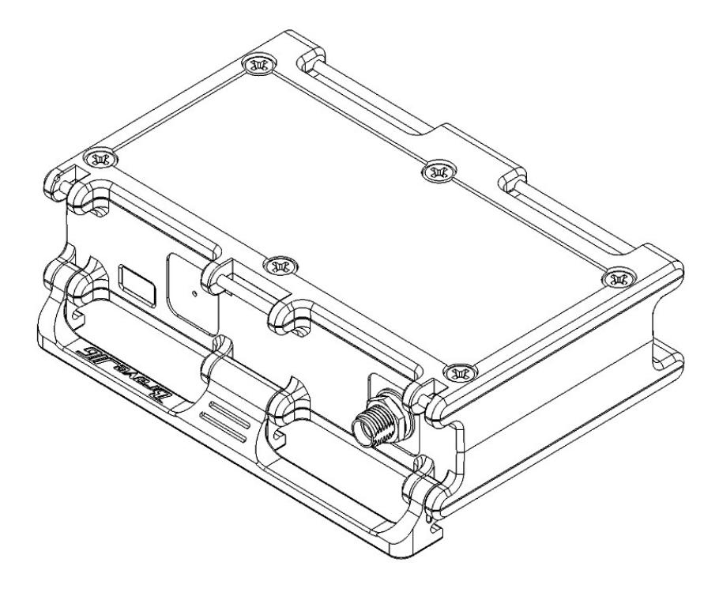
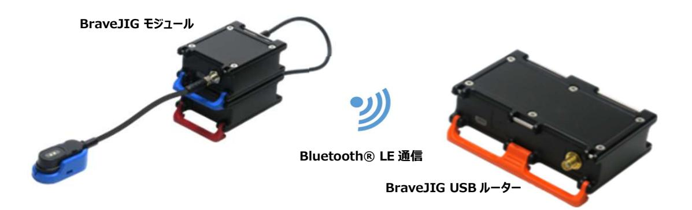
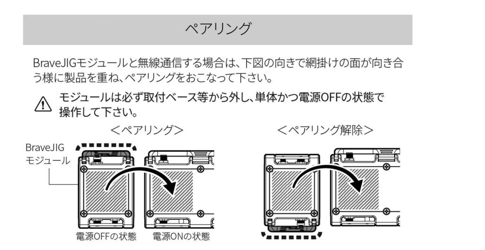

# ソフトウェア仕様書

## BraveJIG USB ルーター

### BJ-RT-USB-01

### REV 1.0

DESIGNED BY Braveridge Co., Ltd.

| 1. 基本仕様  3                                         |  |
|----------------------------------------------------|--|
| 1-1. 特徴  3                                         |  |
| 1-2. 対象ハードウェア  3                                   |  |
| 1-3. 機能概要 3                                        |  |
| 2. 機能概要  3                                         |  |
| 2-1. アップリンク機能  3                                   |  |
| 2-2. ダウンリンク機能  3                                   |  |
| 2-3. NFC ペアリング機能  3                                |  |
| 2-4. DFU 機能  3                                     |  |
| 3. パラメータ情報  4                                      |  |
| 4. LED と音声仕様  4                                    |  |
| 4-1. LED 仕様  4                                     |  |
| 4-2. 音声仕様 4                                        |  |
| 5. コマンド仕様  5                                       |  |
| 5-1. 通知・レスポンスコマンド  5                               |  |
| 5-1-1. アップリンク 通知  5                                |  |
| 5-1-2. ダウンリンクレスポンス  5 5-1-3. JIG Info レスポンス  6  |  |
| 5-1-4. DFU レスポンス  7                                |  |
| 5-1-5. エラー通知  7                                    |  |
| 5-2. リクエストコマンド  7                                  |  |
| 5-2-1. ダウンリンクリクエスト  7                              |  |
| 5-2-2. JIG Info リクエスト  8                           |  |
| 5-2-3. DFU リクエスト  8                                |  |
| 6. 製品到着から使用開始までの流れ  9                              |  |
| 6-1. BraveJIG ルーターと BraveJIG モジュールのペアリング登録  9      |  |
| 6-2. BraveJIG ルーターと BraveJIG モジュールの機器接続と利用開始  9 |  |
| 7. DFU ファイルの入手先  9                                 |  |
| 8. Revision 管理  9                                  |  |

#### 1. 基本仕様

#### 1-1. 特徴

本製品は Bluetooth LE により BraveJIG モジュールとの通信を USB 接続先に対して中継します。

#### 1-2. 対象ハードウェア

本仕様書の対象となるハードウェアを以下に示します。

| 製品名               | 型番           |
|-------------------|--------------|
| BraveJIG USB ルーター | BJ-RT-USB-01 |

#### 1-3. 機能概要

本製品は、事前にペアリングされた BraveJIG モジュールから Bluetooth® LE 通信を介してデータを取得します。 取得したデータは USB 接続先の上位アプリケーションなどにアップリンクデータとして送信します。

#### 2. 機能概要

#### 2-1. アップリンク機能

本製品はペアリング済みの BraveJIG モジュールから送信されたデータを USB 接続先にアップリンクします。アップリンクの 詳細については、「5-1 通知・レスポンスコマンド」を参照してください。

#### 2-2. ダウンリンク機能

本製品は USB 接続先からペアリング済みの BraveJIG モジュール、または本製品にダウンリンクが可能です。ダウンリンクの 詳細については、「5-2 リクエストコマンド」を参照してください。

#### 2-3. NFC ペアリング機能

本製品は NFC Reader/Writer 機能によって、BraveJIG モジュールとペアリング・ペアリング削除を行うことができます。

#### 2-4. DFU 機能

本製品は USB 通信を使用して、FW の更新が可能です。本製品の DFU 機能については、「5 コマンド仕様」を参照して ください。

#### 3. パラメータ情報

本製品のパラメータを以下に示します。

USB 通信により以下のパラメータの変更・取得が可能です。

| パラメータ項目   | 設定情報                                                 |                  |
|----------------|--------------------------------------------------------|------------------|
| Pairing Device | 本製品と通信を行うデバイスの Device ID。100 個まで保存可能です。 登録された Device ID を持つ BraveJIGモジュールとのみ通信を行います。               |                  |
| Bluetooth Mode | Bluetooth 通信モードの設定情報を以下に示します。 デフォルト値は LongRange です。 |                  |

|                | 設定値                                                  | 説明              |
|----------------|--------------------------------------------------------|------------------|
|                | 0x00                                                   | LongRange        |
|                | 0x01                                                   | Legacy           |
|                | 上記以外                                                | LongRange         |

### 4. LED と音声仕様

#### 4-1. LED 仕様

| No | 状態                  | LED(発行色) | 点灯パターン  |
|----|---------------------|----------|---------|
| 1  | 動作停止中               | グラデーション  | 連続点灯    |
| 2  | アップリンク確認中またはアップリンク中 | シアン      | フェード ※1 |
| 3  | ペアリング設定中            | シアン      | 点滅 ※2   |
| 4  | ダウンリンク中             | マゼンタ     | フェード ※1 |
| 5  | DFU データ受信中          | グリーン     | フェード ※1 |
| 6  | DFU 中               | ブルー      | フェード ※1 |

#### 4-2. 音声仕様

| No | 状態                             | 音声パターン                     |
|----|--------------------------------|----------------------------|
| 1  | 電源 ON 時                        | 起動しました。                    |
| 2  | ペアリング完了時                       | ペアリングを完了しました。              |
| 3  | ペアリング削除完了時                     | ペアリングを削除しました。              |
| 4  | ペアリングに失敗した時                    | ペアリングに失敗しました。              |
| 5  | ペアリング削除に失敗した時                  | ペアリング削除に失敗しました。            |
| 6  | 他のルーターとペアリングした BraveJIG モジュールとペアリングをしようとした時 | 他のルーターとペアリング済みです。          |
| 7  | 他のルーターとペアリングした BraveJIG モジュールとペアリング削除をおこなった時 | エラー、ペアリングをおこなったルーターで削除してください。   |
| 8  | ペアリングされていない BraveJIG モジュールでペアリング削除をおこなった時 | エラー、削除するペアリング情報はありません。     |
| 9  | ペアリング済みの BraveJIG モジュールでペアリングをおこなった時 | このモジュールは既にペアリングされています。     |
| 10 | ペアリングを開始する時                    | ペアリングを開始します。完了するまで動かさないでください。 |
| 11 | ペアリング削除を開始する時                  | ペアリング削除を開始します。完了するまで動かさないでください。  |

#### 5. コマンド仕様

#### 5-1. 通知・レスポンスコマンド

USB 接続先に対して、BraveJIG ルーターから以下のフォーマットでデータを送信します。

#### 5-1-1. アップリンク 通知

BraveJIG モジュールからのアップリンクデータを以下のフォーマットで送信します。

| Index | Name             | Size   | Description                         |
|-------|------------------|--------|-------------------------------------|
| 0     | Protocol Version | 1byte  | 0x01 : コマンドのバージョン                   |
| 1     | Type             | 1byte  | 0x00 : アップリンク通知                     |
| 2     | Data Length      | 2byte  | Data 部分のサイズ                         |
| 4     | Unix Time        | 4byte  | Unix Time                           |
| 8     | Device ID        | 8byte  | アップリンクされた BraveJIG モジュールの Device ID |
| 16    | Sensor ID        | 2byte  | アップリンクされたデータの Sensor ID             |
| 18    | RSSI             | 1byte  | Bluetooth🄬 LE 通信時の RSSI             |
| 19    | Order            | 2byte  | 0x00 から始まってデータの順番にインクリメント           |
|       |                  |        | 最後のデータの場合 0xFFFF を指定                |
| 21~   | Data             | n byte |                                     |

BraveJIG モジュールからアップリンクされる Data 部の詳細については、各 BraveJIG モジュールのソフトウェア仕様書を 参照ください。

#### 5-1-2. ダウンリンクレスポンス

送信されたダウンリンクリクエストに対するレスポンスを以下のフォーマットで送信します。

| Index | Name             | Size  | Description                         |
|-------|------------------|-------|-------------------------------------|
| 0     | Protocol Version | 1byte | 0x01 : コマンドのバージョン                   |
| 1     | Type             | 1byte | 0x01 : ダウンリンクレスポンス                  |
| 2     | Unix Time        | 4byte | Unix Time                           |
| 6     | Device ID        | 8byte | アップリンクされた BraveJIG モジュールの Device ID |
| 14    | Sensor ID        | 2byte | アップリンクされたデータの Sensor ID             |
| 16    | Order            | 2byte | 0x00 から始まってデータの順番にインクリメント。最後のデータの場合 0xFFFF を指定           |
| 18    | CMD              | 1byte | 対応するダウンリンクリクエストの CMD                |
| 19    | Result           | 1byte | 以下のダウンリンクレスポンスの結果一覧を参照              |

#### ■ ダウンリンクレスポンスの結果一覧

| 値    | 詳細                 | 判断場所 |       |  |
|------|--------------------|------|-------|--|
|      |                    | ルーター | モジュール |  |
| 0x00 | 設定完了 (正常終了)        |      | 〇     |  |
| 0x01 | 設定失敗 (SensorID 不正) |      | 〇     |  |
| 0x02 | 設定失敗 (未サポートの CMD)  |      | 〇     |  |
| 0x03 | 設定失敗 (設定値範囲外)      |      | 〇     |  |
| 0x04 | 設定失敗 (接続失敗)        | 〇    |       |  |
| 0x05 | 設定失敗 (タイムアウト)      | 〇    |       |  |

| 0x06 | Reserved          |   |   |
|------|-------------------|---|---|
| 0x07 | 検索失敗 (対象デバイスなし)   | 〇 |   |
| 0x08 | 設定失敗 (ルーターBusy)   | 〇 |   |
| 0x09 | 設定失敗 (モジュール Busy) |   | 〇 |

#### 5-1-3. JIG Info レスポンス

送信された JIG Info リクエストに対するレスポンスを以下のフォーマットで送信します。

| Index | Name             | Size   | Description                         |
|-------|------------------|--------|-------------------------------------|
| 0     | Protocol Version | 1byte  | コマンドのバージョン                          |
| 1     | Type             | 1byte  | 0x02 : JIG Info レスポンス               |
| 2     | Unix Time        | 4byte  | Unix Time                           |
| 6     | CMD              | 1byte  | JIG Info リクエストで指定された CMD (5-2-2 JIG Info CMD 一覧参照)           |
| 9     | Router Device ID | 8byte  | 本製品の Device ID                      |
| 17~   | Data             | n byte | 以下の「JIG Info の各コマンドに対するレスポンスについて」参照 |

JIG Info の各コマンドに対するレスポンスについて

上記 JIG Info の Data はリクエストした CMD により、レスポンスが以下のフォーマットで送信されます。

#### ● <開始・停止・Scan Mode 変更・Device ID リスト削除>

| Index | Name   | Size  | Description |
|-------|--------|-------|-------------|
| 17    | Result | 1byte | 0x00: 失敗、 0x01: 成功    |

※Scan Mode の変更後、変更を反映させるために一度停止を行い、再度開始を行ってください。

#### ● <FW バージョン取得>

| Index | Name         | Size  | Description |
|-------|--------------|-------|-------------|
| 17    | Major        | 1byte | メジャーバージョン   |
| 18    | Minor        | 1byte | マイナーバージョン   |
| 19    | Build Number | 1byte | ビルド番号       |

#### ● <Device ID リスト取得>

| Index | Name      | Size  | Description           |
|-------|-----------|-------|-----------------------|
| 17    | Index     | 1byte | 取得した Device ID リストの番号 |
| 18    | Device ID | 8byte | 取得した Device ID        |

#### ● <Scan Mode 取得>

| Index | Name | Size  | Description       |
|-------|------|-------|-------------------|
| 17    | Mode | 1byte | 0x00: Long Range、0x01: Legacy、その他 : Long Range  |

#### 5-1-4. DFU レスポンス

送信された DFU リクエストに対するレスポンスを以下のフォーマットで送信します。

| Index | Name             | Size  | Description       |
|-------|------------------|-------|-------------------|
| 0     | Protocol Version | 1byte | 0x01 : コマンドのバージョン |
| 1     | Type             | 1byte | 0x03 : DFU レスポンス  |
| 2     | Unix Time        | 4byte | Unix Time         |
| 6     | Result           | 1byte | 0x00 : 失敗、0x01 : 成功         |

#### 5-1-5. エラー通知

エラーが発生した場合に以下のフォーマットでエラー内容を通知します。

| Index | Name             | Size  | Description       |
|-------|------------------|-------|-------------------|
| 0     | Protocol Version | 1byte | 0x01 : コマンドのバージョン |
| 1     | Type             | 1byte | 0xFF : エラー通知      |
| 2     | Unix Time        | 4byte | Unix Time         |
| 6     | Reason           | 1byte | 以下のエラー内容一覧を参照     |

#### ■ エラー内容一覧

| 値    | 詳細                               |
|------|----------------------------------|
| 0x01 | 不正なリクエスト                         |
| 0x02 | ダウンリンク処理中                        |
| 0x03 | Reserved                         |
| 0x04 | Reserved                         |
| 0x05 | Reserved                         |
| 0x06 | 指定されたインデックスに Device ID が登録されていない |

#### 5-2. リクエストコマンド

USB 接続先は BraveJIG ルーターへ以下のフォーマットでリクエストを送信できます。

#### 5-2-1. ダウンリンクリクエスト

| Index | Name             | Size   | Description                        |
|-------|------------------|--------|------------------------------------|
| 0     | Protocol Version | 1byte  | 0x01 : コマンドのバージョン                  |
| 1     | Type             | 1byte  | 0x00 : ダウンリンクリクエスト                 |
| 2     | Data Length      | 2byte  | Data 部分のサイズ                        |
| 4     | Unix Time        | 4byte  | Unix Time                          |
| 8     | Device ID        | 8byte  | ダウンリンクする BraveJIG モジュールの Device ID |
| 16    | Sensor ID        | 2byte  | ダウンリンク対象の Sensor ID                |
| 18    | CMD              | 1byte  | ダウンリンク要求コマンド (各 BraveJIG モジュールのソフトウェア仕様書を参照ください)                      |
| 19    | Order            | 2byte  | 0x00 から始まってデータの順番にインクリメント(最後のデータの場合 0xFFFF を指定)          |
| 21~   | Data             | n byte |                                    |

ダウンリンクデータの詳細については、各 BraveJIG モジュールのソフトウェア仕様書を参照ください。

#### 5-2-2. JIG Info リクエスト

| Index | Name             | Size  | Description           |
|-------|------------------|-------|-----------------------|
| 0     | Protocol Version | 1byte | 0x01 : コマンドのバージョン     |
| 1     | Type             | 1byte | 0x01 : JIG Info リクエスト |
| 2     | CMD              | 1byte | 以下の JIG Info CMD 一覧参照 |
| 3     | Local Time       | 4byte | 日本時間 (UTC + 9 時間)     |
| 7     | Unix Time        | 4byte | Unix Time             |

#### ■ JIG Info CMD 一覧

| 値    | 詳細                            |
|------|-------------------------------|
| 0x00 | 停止                            |
| 0x01 | 開始                            |
| 0x02 | FW バージョン取得                    |
| 0x03 | Device ID リスト Index 0 取得      |
| 0x04 | Device ID リスト Index 1 取得      |
| ・・・  |                               |
| 0x66 | Device ID リスト Index 99 取得     |
| 0x67 | Scan Mode 取得                  |
| 0x69 | Scan Mode を Long Range に変更 |
| 0x6A | Scan Mode を Legacy に変更     |
| 0x6B | Device ID リスト全削除              |
| 0x6C | Device ID リスト Index 0 削除      |
| 0x6D | Device ID リスト Index 1 削除      |
| ・・・  |                               |
| 0xCE | Device ID リスト Index 99 削除     |
| 0xCF | DeviceID リスト全取得               |
| 0xD0 | Keep Alive (Unix Time の同期)    |

#### 5-2-3. DFU リクエスト

| Index | Name             | Size  | Description       |
|-------|------------------|-------|-------------------|
| 0     | Protocol Version | 1byte | 0x01 : コマンドのバージョン |
| 1     | Type             | 1byte | 0x03 : DFU リクエスト  |
| 2     | Unix Time        | 4byte | Unix Time         |
| 6     | Total Length     | 4byte | DFU イメージのサイズ      |

このコマンドの後に DFU レスポンスで Result=1 が返された場合、以下のフォーマットで DFU イメージを分割しながら送信 をしてください。

| Index | Name        | Size   | Description              |
|-------|-------------|--------|--------------------------|
| 0     | Packet Size | 2byte  | 以下の DFU Image サイズ        |
| 2     | DFU Image   | n byte | 分割された DFU イメージの一部(1byte から 1024byte まで設定可能)        |
|       |             |        |  |

#### 6. 製品到着から使用開始までの流れ

#### 6-1. BraveJIG ルーターと BraveJIG モジュールのペアリング登録

BraveJIG ルーターと BraveJIG モジュールのペアリング登録手順について以下に示します。

- 1 BraveJIG ルーターを電源 ON の状態にしておく。
- 2 BraveJIG モジュールを電源 OFF 状態(モジュール用バッテリーやモジュールケーブルで給電しない)にする。
- 3 BraveJIG モジュールの天面(NFC アンテナ)の「Pairing」の刻印が本製品天面(同じく NFC アンテナ)の 「Pairing/Reset」の刻印と同じ方向に向けた状態で BraveJIG モジュールを裏返して、両製品の NFC アンテナ同士が 重なるようにしてペアリング登録を行う。
- 4 BraveJIG ルーターからの音声ガイダンス「ペアリングが完了しました」によりペアリングが正常に行われた事を確認する。
- 以上でペアリング登録の作業は終了です。

#### 6-2. BraveJIG ルーターと BraveJIG モジュールの機器接続と利用開始

BraveJIG ルーターと BraveJIG モジュールの接続手順について以下に示します。

- 1 BraveJIG モジュールにセンサーを接続する(事前に BraveJIG センサーが接続されていない場合のみ)
- 2 BraveJIG モジュールを電源 ON 状態(モジュール用バッテリーやモジュールケーブルに接続する)にする。
- 3 BraveJIG モジュールの電源 ON 起動時の LED 表示(ブルー:2 秒 ON→消灯)から LED が全照灯となり通常動作 状態となる事を確認する。

以上で機器接続の作業は終了です(機器の利用開始状態になります)。

#### 7. DFU ファイルの入手先

本製品の DFU ファイルは、BraveJIG サイト[サポート]ー[ソフトウェア]から入手が可能です。 BraveJIG ソフトウェアページ:https://jig.braveridge.com/support/software/

#### 8. Revision 管理

| Rev | Date       | Firmware | 変更内容 |
|-----|------------|----------|------|
| 1.0 | 2024/12/20 | Ver1.0.0 | 初版   |

※上記、製品仕様や機能、デザインは変更となる可能性がございます。あらかじめご了承ください。

株式会社 Braveridge に関する詳しい情報は、弊社 Web サイトからご確認ください。 https://www.braveridge.com/

本製品の詳しい使い方のご確認、故障や破損についてのお問合せは、下記の QR コードから製品ページにアクセスしお問合せ ください。

株式会社 Braveridge 本社 〒819-0373 福岡県福岡市西区周船寺 3-27-2 Tel: 092-834-5789

株式会社 Braveridge 糸島工場 〒819-1122 福岡県糸島市東 1999-19